# govcy Express Services

> ⚠️ **Warning:**  
> This package is under active development and is not a finished product. It is intended for testing, acceptance, integration, and browser testing purposes only.  
> **No guarantees are provided regarding stability, security, or compliance. Using this package does not imply your product or service will automatically pass any required assessments, audits, or certifications by the Cyprus government or any other authority.**  
> You are responsible for ensuring your own compliance, security, and quality assurance processes.

## 📝 Description
This project is an Express-based project that dynamically renders online service forms using `@gov-cy/govcy-frontend-renderer`. It is designed for developers building government services in Cyprus, enabling them to manage user authentication, form submissions, and OpenID authentication workflows in a timely manner.


## Table of contents

- [📝 Description](#-description)
- [✨ Features](#-features)
- [📋 Prerequisites](#-prerequisites)
- [🚀 Quick start](#-quick-start)
- [📦 Full installation guide](#-full-installation-guide)
- [🛠️ Usage](#%EF%B8%8F-usage)
  - [🧩 Dynamic services rendering](#-dynamic-services-rendering)
  - [🛡️ Site eligibility checks](#%EF%B8%8F-site-eligibility-checks)
  - [📤 Site submissions](#-site-submissions)
  - [✅ Input validations](#-input-validations)
- [🛣️ Routes](#%EF%B8%8F-routes)
- [🔒 Security note](#-security-note)
- [❓ Troubleshooting / FAQ](#-troubleshooting--faq)
- [🙏 Credits](#-credits)
- [💡 Developer notes](#-developer-notes)
- [📄 License](#-license)
- [📬 Contact](#contact)

## ✨ Features
- Dynamic form rendering from JSON templates
    - Support for `textInput`, `textArea`, `select`, `radios`, `checkboxes`, `datePicker`, `dateInput`
    - Support for `conditional radios`
- Dynamic creation of check your answers page
- OpenID Connect authentication with CY Login
- Middleware-based architecture for better maintainability
- Supports routing for dynamic pages
- Input validation
- CSRF protection
- cyLogin Single Sign-On (SSO) for physical authorized users
- Pre-filling posted values (in the same session)
- Site level API eligibility checks
- API integration with retry logic for form submissions.

## 📋 Prerequisites
- Node.js 20+
- npm 
- A CY Login client ID and secret
- An API endpoint for form submissions (through cyConnect)

## 🚀 Quick start

```sh
# 1. Install the package
npm install @gov-cy/govcy-express-services

# 2. Generate SSL certificates for local development
openssl req -x509 -newkey rsa:2048 -keyout server.key -out server.cert -days 365 -nodes

# 3. Create a .env file in your project root (see below for required variables)

# 4. Add a minimal data config file in /data (see test.json example)

# 5. Create an index.mjs file:
```

```js
// index.mjs
import initializeGovCyExpressService from '@gov-cy/govcy-express-services';

const service = initializeGovCyExpressService();
service.startServer();
```

```sh
# 6. Start the server
npm start
```

- Visit [https://localhost:44319](https://localhost:44319) in your browser.
- Log in with CY Login and start using your dynamic service!

---

**Tip:**  
For more details on configuration, environment variables, and advanced features, see the sections below.

## 📦 Full installation guide
The project acts as an npm package and you need to install it as a dependency in your npm project. Check out the [install notes](INSTALL-NOTES.md) a detailed installation guide.

## 🛠️ Usage
### Starting the Server
Add in your `package.json`:

```json
"scripts": {
    "start": "node index.mjs"
}
```

Then run the server using `npm start`.

```sh
npm start
```
The server will start on `https://localhost:44319` (see [NOTES.md](NOTES.md#local-development) for more details on this).

### Authentication Middleware
Authentication is handled via OpenID Connect using CY Login and is configured using environment variables. The middleware ensures users have valid sessions before accessing protected routes. 

The CY Login tokens are used to also connect with the various APIs through [cyConnect](https://dev.azure.com/cyprus-gov-cds/Documentation/_wiki/wikis/Documentation/74/CY-Connect), so make sure to include the correct `scope` when requesting for a [cyLogin client registration](https://dev.azure.com/cyprus-gov-cds/Documentation/_wiki/wikis/Documentation/34/Developer-Guide).

### 🧩 Dynamic Services Rendering
Services are rendered dynamically using JSON templates stored in the `/data` folder. All the service configuration, pages, routes, and logic is stored in the JSON files. The service will load `data/:siteId.json` to get the form data when a user visits `/:siteId/:pageUrl`. Checkout the [express-service-shema.json](express-service-shema.json) and the example JSON structure of the **[test.json](data/test.json)** file for more details.

Here are some details explaining the JSON structure:

- `site` object: Contains information about the site, including the site ID, language, and footer links. See [govcy-frontend-renderer](https://github.com/gov-cy/govcy-frontend-renderer/tree/main#site-and-page-meta-data-explained) for more details. Some fields that are only specific to the govcy-express-forms project are the following:
  - `submission_data_version` : The submission data version,
  - `renderer_version` : The govcy-frontend-renderer version,
  - `design_systems_version` : The govcy-design-system version,
  - `homeRedirectPage`: The page to redirect when user visits the route page. Usually this will redirect to gov.cy page. If not provided will show a list of available sites.
  - `matomo `: The Matomo web analytics configuration details.
  - `eligibilityAPIEndpoints` : An array of API endpoints, to be used for service eligibility. See more on the [Eligibility API Endoints](#%EF%B8%8F-site-eligibility-checks) section below.
  - `submissionAPIEndpoint`: The submission API endpoint, to be used for submitting the form. See more on the [Submission API Endoint](#-site-submissions) section below.
- `pages` array: An array of page objects, each representing a page in the site. 
    - `pageData` object: Contains the metadata to be rendered on the page. See [govcy-frontend-renderer](https://github.com/gov-cy/govcy-frontend-renderer/tree/main#site-and-page-meta-data-explained) for more details
    - `pageTemplate` object: Contains the page template to be rendered on the page. See [govcy-frontend-renderer](https://github.com/gov-cy/govcy-frontend-renderer/tree/main#json-input-template) for more details
      - `elements` array: An array of elements to be rendered on the page. See all supported [govcy-frontend-renderer elements](https://github.com/gov-cy/govcy-frontend-renderer/blob/main/DESIGN_ELEMENTS.md) for more details


A typical service flow that includes pages `index`, `question-1`, `question-2` under the `pages` array in the JSON file looks like this:

```mermaid
flowchart TD
    govcy-page --> isAuth{Is User Authenticated?}
    isAuth -- Yes<br><br> Eligibility Check --> index([:siteId/index])
    isAuth -- No --> cyLogin[cyLogin]
    cyLogin -- Eligibility Check --> index
    index --  Eligibility Check<br> Validations --> question-1[:siteId/question-1]
    question-1 --  Eligibility Check<br> Validations --> question-2[:siteId/question-2]
    question-2 --  Eligibility Check<br> Validations --> review[📄:siteId/review <br> <br> Automatically generated]
    review --  Eligibility Check<br> All Validations --> success([✅:siteId/success <br> <br> Automatically generated])

```



Some pages are generated automatically by the project, such as the `review` and `success` pages.

#### Pages

Pages defined in the JSON file under the `pages` array, they rendered based on the [govcy-frontend-renderer](https://github.com/gov-cy/govcy-frontend-renderer) library, and they are served by the `/:siteId/:pageUrl` route. The `pageData.nextPage` field is used to determine the next page to render.

Here's an example of a page defined in the JSON file:

```json
{
  "pageData": {
    "url": "index",
    "title": {
      "el": "Your email",
      "en": "Το email σας"
    },
    "layout": "layouts/govcyBase.njk",
    "mainLayout": "two-third",
    "nextPage": "telephone-number"
  },
  "pageTemplate": {
    "sections": [
      {
        "name": "beforeMain",
        "elements": [
          {
            "element": "backLink",
            "params": {}
          }
        ],
        "params": {}
      },
      {
        "name": "main",
        "elements": [
          {
            "element": "form",   
            "params": {
              "elements": [
                {
                  "element": "textInput",
                  "params": {
                      "label": {
                          "en": "What is your email?",
                          "el": "Ποιο είναι το email σας?"
                      },
                      "id": "email",
                      "name": "email",
                      "hint": {
                          "en": "We’ll only use this email for this application",
                          "el": "Θα χρησιμοποιήσουμε το email σας μόνο για αυτήν την υπηρεσία"
                      },
                      "type": "email",
                      "isPageHeading": true,
                      "fixedWidth": "50"
                  },
                  "validations": [
                    {
                        "check": "required",
                        "params": {
                        "message": {
                            "en": "Enter your email",
                            "el": "Εισαγάγετε το email σας"
                        }
                        }
                    },
                    {
                        "check": "valid",
                        "params": {
                        "checkValue": "email",
                        "message": {
                            "en": "Your email must be a valid email address",
                            "el": "To emial πρέπει να είναι έχει μορφή email address"
                        }
                        }
                    }
                ]
                },
                {
                  "element": "button",
                  "params": {
                    "id": "continue",
                    "variant": "primary",
                    "text": {
                      "el": "Συνέχεια",
                      "en": "Continue"
                    }
                  }
                }
              ]
            }
          }
        ]
      }
    ]
  }
}
```

The JSON structure is based on the [govcy-frontend-renderer's JSON template](https://github.com/gov-cy/govcy-frontend-renderer/blob/main/README.md#json-template-example).

Lets break down the JSON config for this page:

- **pageData** are the page's meta data, such as the URL, title, layout, mainLayout, and nextPage.
  - `pageData.url` is the URL of the page, in this case it's `:siteId/index`
  - `pageData.title` is the title of the page, in this case it's `Your email`. This will be used in the `review`, `success` pages, the PDF, the email, and the submission platform. 
  - `pageData.layout` is the layout used to render the page. The project only supports the default layout `layouts/govcyBase.njk`
  - `pageData.mainLayout` is the layout of the `main` section of the page, in this case it's `two-third`. It can be either `two-third` or `max-width`,
  - `pageData.nextPage` is the next page to redirect to when the user clicks the `continue` button and all validations pass, in this case it will redirect to `/:siteId/telephone-number`
- **pageTemplate** is the page's template, which is a JSON object that contains the sections and elements of the page. Check out the [govcy-frontend-renderer's documentation](https://github.com/gov-cy/govcy-frontend-renderer/blob/main/README.md) for more details.

**Forms vs static content**

- If the `pageTemplate` includes a `form` element in the `main` section and `button` element, the system will treat it as form and will:
  - Perform the eligibility checks
  - Display the form
  - Collect the form data
  - Validate the form data
  - Store the form data in the systems data layer
  - Redirect the user to the next page (or `review` page if the user came from the review page)
- Else if the `pageTemplate` does not include a `form` element in the `main` section, the system will treat it as static content and will:
  - Not perform the eligibility checks
  - Display the static content

**Notes**:
- Check out the [govcy-frontend-renderer's design elements](https://github.com/gov-cy/govcy-frontend-renderer/blob/main/DESIGN_ELEMENTS.md) for more details on the supported elements and their parameters.
- Check out the [input validations section](#-input-validations) for more details on how to add validations to the JSON file.

#### Review page

The `review` page is automatically generated by the project and includes the following sections:

- **Summary**: A summary of the data from all the pages in the service.
- **Change links**: A list of links to each page in the service.
- **Submit button**: A button to submit the form.

When the user clicks a change link, the user is redirected to the corresponding page in the service. After the user clicks on `continue` button the user is redirected back to the `review` page.

When the user clicks the `Submit` button, all the data gathered from the site's forms within this session are validated based on the validation definition in the JSON file, and if they pass they are submitted to the configured API endpoint.

#### Success page

The `success` page is automatically generated by the project, is accessible only when a submission is made successfully, and includes the following sections:

- **Success banner**: A banner indicating that the form was successfully submitted, with the reference number of the submission.
- **PDF Download link**: A link to download the PDF of the submission's data in a human-readable format.
- **Summary**: A summary of the data from all the pages in the service.

### 🛡️ Site eligibility checks

The project uses an array of API endpoints to check the eligibility of a service/site. To use this feature, you need to configure the following in your JSON file under the `site` object:

```json
"eligibilityAPIEndpoints" : [
  {
    "url": "TEST_ELIGIBILITY_1_API_URL",
    "method": "POST", 
    "clientKey": "TEST_SUBMISSION_API_CLIENT_KEY",
    "serviceId": "TEST_SUBMISSION_API_SERVIVE_ID",
    "cashingTimeoutMinutes": 2,
    "params": {
      "checkFor": "isCitizen,isAdult"
    },
    "response": {
      "errorResponse": {
        "102": {
          "error": "user not administrator",
          "page": "/test/user-not-admin"
        }
      }
    }
  },
  {
    "url": "TEST_ELIGIBILITY_2_API_URL",
    "clientKey": "TEST_SUBMISSION_API_CLIENT_KEY",
    "serviceId": "TEST_SUBMISSION_API_SERVIVE_ID",
    "cashingTimeoutMinutes": 60,
    "response": {
      "errorResponse": {
        "105": {
          "error": "user not registration",
          "page": "/test/user-not-registered"
        }
      }
    }
  }
]
```

If no `eligibilityAPIEndpoints` are configured, the system will not check for service eligibility for the specific site.

Lets break the JSON config down:

- `eligibilityAPIEndpoints` : An array of API endpoints, to be used for service eligibility.
  - `url`: The enviromental variable that holds the URL of the API endpoint.
  - `method`: The HTTP method to use when making the request.
  - `clientId`: The enviromental variable that holds the client ID to use when making the request.
  - `clientSecret`: The enviromental variable that holds the client secret to use when making the request.
  - `cashingTimeoutMinutes`: The number of minutes to cache the response from the API endpoint. If set to `0`, the API endpoint will be called every time.
  - `params`: An object of key-value pairs that will be added to the request body when making the request.
  - `response`: An object of expected response when `succeeded===false`, to be used for the system to know which error page to show. 

The above config references the following environment variables that need to be set:

```sh
TEST_ELIGIBILITY_1_API_URL=http://localhost:3002/check1
TEST_ELIGIBILITY_2_API_URL=http://localhost:3002/check2
TEST_SUBMISSION_API_CLIENT_KEY=12345678901234567890123456789000
TEST_SUBMISSION_API_SERVIVE_ID=123
```

With the above config, when a user visits a page under the specific site, `/:siteId/*`, the service sends a request to the configured eligibility API endpoints. If any of the API endpoints returns `succeeded: false`, the user is redirected to the error page specified in the `response` object. 

The response is cached to the session storage for the specified number of minutes. If the `cashingTimeoutMinutes` is set to `0`, the API endpoint will be called every time.

#### Eligibility API request and response

For each eligibility API endpoint, the project sends a request to the API endpoint. The project uses the [CY Connect - OAuth 2.0 (CY Login)](https://dev.azure.com/cyprus-gov-cds/Documentation/_wiki/wikis/Documentation/122/CY-Connect-OAuth-2.0-(CY-Login)) authentication policy, so the user's `<access_token>` is sent in the `Authorization` header.

**Eligibility Request**

- **HTTP Method**:
  - Defined per endpoint in the method property (defaults to GET if not specified).
- **URL**:
  - Resolved from the url property in your config (from the environment variable).
- **Headers**:
  - **Authorization**: `Bearer <access_token>` (form user's cyLogin access token)
  - **client-key**: `<clientKey>` (from config/env)
  - **service-id**: `<serviceId>` (from config/env)
  - **Accept**: text/plain
**Parameters**: The params object in your config is sent as query parameters for GET requests and as the request body for POST requests.

**Example GET Request:**

```
GET /check-eligibility?checkFor=isCitizen,isAdult HTTP/1.1
Host: localhost:3002
Authorization: Bearer eyJhbGciOi...
client-key: 12345678901234567890123456789000
service-id: 123
Accept: text/plain
```

**Example POST Request**:

```
POST /check-eligibility HTTP/1.1
Host: localhost:3002
Authorization: Bearer eyJhbGciOi...
client-key: 12345678901234567890123456789000
service-id: 123
Accept: text/plain
Content-Type: application/json

{
  "checkFor": "isCitizen,isAdult"
}
```

**Eligibility Response**

The API is expected to return a JSON response with the following structure (see [govcyApiRequest.mjs](src/utils/govcyApiRequest.mjs) for normalization):

**On Success:**
```json
{
  "Succeeded": true,
  "ErrorCode": 0,
  "ErrorMessage": null,
}
```

**On Failure:**
```json
{
  "Succeeded": false,
  "ErrorCode": 102,
  "ErrorMessage": "user not administrator"
}
```


**Notes**:
- If no `eligibilityAPIEndpoints` are configured, the system will not check for service eligibility for the specific site.
- The response is normalized to always use PascalCase keys (`Succeeded`, `ErrorCode`, etc.), regardless of the backend’s casing.
- If `Succeeded` is false, the system will look up the `ErrorCode` in your config to determine which error page to show.

**Caching**
- The response from each eligibility endpoint is cached in the session for the number of minutes specified by `cashingTimeoutMinutes`.
- If `cashingTimeoutMinutes` is set to 0, the API endpoint will be called every time (no caching).
- If omitted or null, the result is cached indefinitely.

**Error Handling**
- If the API returns `Succeeded: false`, the user is redirected to the error page specified in your config for that error code.
- If the API response is invalid or the request fails after retries, a generic error is shown.

**References**
- Eligibility check logic: See [govcyServiceEligibilityHandler.mjs](src/middleware/govcyServiceEligibilityHandler.mjs)
- API call, normalization and retries: See [govcyApiRequest.mjs](src/utils/govcyApiRequest.mjs)

### 📤 Site Submissions

The project uses an API endpoint to submit the form data. The project uses the [CY Connect - OAuth 2.0 (CY Login)](https://dev.azure.com/cyprus-gov-cds/Documentation/_wiki/wikis/Documentation/122/CY-Connect-OAuth-2.0-(CY-Login)) authentication policy, so the user's `<access_token>` is sent in the `Authorization` header.

To use this feature, you need to configure the following in your JSON file under the `site` object:

```json
"submissionAPIEndpoint": {
  "url": "TEST_SUBMISSION_API_URL",
  "clientKey": "TEST_SUBMISSION_API_CLIENT_KEY",
  "serviceId": "TEST_SUBMISSION_API_SERVIVE_ID",
  "response": {
    "errorResponse": {
      "102": {
        "error": "user not administrator",
        "page": "/test/user-not-admin"
      },
      "105": {
        "error": "user not registration",
        "page": "/test/user-not-registered"
      }
    }
  }
}
```
Lets break the JSON config down:

- `submissionAPIEndpoint`: The submission API endpoint, to be used for submitting the form.
  - `url`: The enviromental variable that holds the URL of the API endpoint.
  - `clientId`: The enviromental variable that holds the client ID to use when making the request.
  - `clientSecret`: The enviromental variable that holds the client secret to use when making the request.
  - `response`: An object of expected response when `Succeeded===false`, to be used for the system to know which error page to show. 

The above config references the following environment variables that need to be set:

```sh
TEST_SUBMISSION_API_URL=http://localhost:3002/success
TEST_SUBMISSION_API_CLIENT_KEY=12345678901234567890123456789000
TEST_SUBMISSION_API_SERVIVE_ID=123
```

With the above config, when a user submits the `review` page, the service sends a request to the configured submission API endpoint.

#### Submission API Request and Response

**Submission Request:**

- **HTTP Method**: POST
- **URL**: Resolved from the url property in your config (from the environment variable).
- **Headers**:
  - **Authorization**: `Bearer <access_token>` (form user's cyLogin access token)
  - **client-key**: `<clientKey>` (from config/env)
  - **service-id**: `<serviceId>` (from config/env)
  - **Accept**: `text/plain`
- **Body**: The body contains the prepared submission data, which is a JSON object with all the form data collected from the user across all pages.

**Example Request:**

```
POST /submission-endpoint HTTP/1.1
Host: localhost:3002
Authorization: Bearer eyJhbGciOi...
client-key: 12345678901234567890123456789000
service-id: 123
Accept: text/plain
Content-Type: application/json

{
  "AccountName": "John Doe",
  "Iban": "CY12002001230000000123456789",
  "Swift": "BANKCY2NXXX",
  "Objection": "Accept",
  "ReceiveSettlement": "no",
  ...
}
```

**Submission Response**

The API is expected to return a JSON response with the following structure (see [govcyApiRequest.mjs](src/utils/govcyApiRequest.mjs) for normalization):

**On Success:**
```json
{
  "Succeeded": true,
  "ErrorCode": 0,
  "ErrorMessage": null,
  "Data": {
    "submission_id": "12345678-x"
  }
}
```

**On Failure:**
```json
{
  "Succeeded": false,
  "ErrorCode": 102,
  "ErrorMessage": "user not administrator"
}
```

**Notes**:
- The response is normalized to always use PascalCase keys (`Succeeded`, `ErrorCode`, etc.), regardless of the backend’s casing.
- If `Succeeded` is false, the system will look up the `ErrorCode` in your config to determine which error page to show.

**Error Handling**
- If the API returns `Succeeded: false`, the user is redirected to the error page specified in your config for that error code.
- If the API response is invalid or the request fails after retries, a generic error is shown.

**References**
- Request/response logic: See [govcyReviewPostHandler.mjs](src/middleware/govcyReviewPostHandler.mjs)
- API call, normalization and retries: See [govcyApiRequest.mjs](src/utils/govcyApiRequest.mjs)

#### Submission Data

The data is collected from the form elements and the data layer and are sent via the submission API in the following format:

```json
"submissionData": {           // Site level successful submission data
  "submission_username" : "", // User's username
  "submission_email" : "",    // User's email
  "submission_data": {},      // Raw data as submitted by the user in each page
  "submission_data_version": "", // The submission data version
  "print_friendly_data": [],  // Print friendly data
  "renderer_data" :{},        // Renderer data of the summary list
  "renderer_version": "",     // The renderer version
  "design_systems_version": "", // The design systems version
  "service": {                // Service info
        "id": "",             // Service id
        "title": {}           // Service title multilingual object
    }
}
```

<details>
  <summary>Here's a sample submission data JSON</summary>

```jsonc
{
  "submission_username": "username",        // User's username
  "submission_email": "email@example.com",  // User's email
  "submission_data_version": "0.1",         // Submission data version
  "submission_data": {                      // Submission raw data
    "index": {                              // Page level
      "formData": {
        "id_select": ["id", "arc"],         // field level. Could be string or array
        "id_number": "654654",
        "arc_number": "",
        "aka": "232323",
        "_csrf": "o6s80zgvowsmzm3q1djl03etarbd1pnd"
      }
    },
    "appointment": {
      "formData": {
        "diorismos": "monimos",
        "fileno_monimos": "3233",
        "eidikotita_monimos": "1",
        "fileno_sumvasiouxos": "",
        "eidikotita_sumvasiouxos": "",
        "fileno_aoristou": "",
        "eidikotita_aoristou": "",
        "program": "",
        "fileno_orismenou": "",
        "_csrf": "o6s80zgvowsmzm3q1djl03etarbd1pnd"
      }
    },
    "takeover": {
      "formData": {
        "date_start_day": "11",
        "date_start_month": "12",
        "date_start_year": "2020",
        "date_on_contract": "date_other",
        "date_contract": "16/04/2025",
        "reason": "24324dssf",
        "_csrf": "o6s80zgvowsmzm3q1djl03etarbd1pnd"
      }
    }
  },
  "submission_data_version": "1",           // Submission data version
  "renderer_data": {                        // Summary list renderer data ready for rendering
    "element": "summaryList",
    "params": {
      "items": [
        {
          "key": {
            "el": "Στοιχεία του  εκπαιδευτικού",
            "en": "Educator's details",
            "tr": ""
          },
          "value": [
            {
              "element": "summaryList",
              "params": {
                "items": [
                  {
                    "key": {
                      "el": "Ταυτοποίηση",
                      "en": "Identification"
                    },
                    "value": [
                      {
                        "element": "textElement",
                        "params": {
                          "text": {
                            "en": "Ταυτότητα, ARC",
                            "el": "Ταυτότητα, ARC",
                            "tr": "Ταυτότητα, ARC"
                          },
                          "type": "span"
                        }
                      }
                    ]
                  },
                  {
                    "key": {
                      "el": "Εισαγάγετε αριθμό ταυτότητας",
                      "en": "Enter ID number"
                    },
                    "value": [
                      {
                        "element": "textElement",
                        "params": {
                          "text": {
                            "en": "121212",
                            "el": "121212",
                            "tr": "121212"
                          },
                          "type": "span"
                        }
                      }
                    ]
                  },
                  {
                    "key": {
                      "el": "Αριθμός κοινωνικών ασφαλίσεων",
                      "en": "Social Insurance Number"
                    },
                    "value": [
                      {
                        "element": "textElement",
                        "params": {
                          "text": {
                            "en": "112121",
                            "el": "112121",
                            "tr": "112121"
                          },
                          "type": "span"
                        }
                      }
                    ]
                  }
                ]
              }
            }
          ]
        },
        {
          "key": {
            "el": "Διορισμός εκπαιδευτικού",
            "en": "Teachers appointment",
            "tr": ""
          },
          "value": [
            {
              "element": "summaryList",
              "params": {
                "items": [
                  {
                    "key": {
                      "el": "Τι διορισμό έχει ο εκπαιδευτικός;",
                      "en": "What type of appointment does the teacher have?"
                    },
                    "value": [
                      {
                        "element": "textElement",
                        "params": {
                          "text": {
                            "en": "Συμβασιούχος",
                            "el": "Συμβασιούχος",
                            "tr": "Συμβασιούχος"
                          },
                          "type": "span"
                        }
                      }
                    ]
                  },
                  {
                    "key": {
                      "el": "Αριθμός φακέλου (ΠΜΠ)",
                      "en": "File Number"
                    },
                    "value": [
                      {
                        "element": "textElement",
                        "params": {
                          "text": {
                            "en": "1212",
                            "el": "1212",
                            "tr": "1212"
                          },
                          "type": "span"
                        }
                      }
                    ]
                  },
                  {
                    "key": {
                      "el": "Ειδικότητα",
                      "en": "Specialty"
                    },
                    "value": [
                      {
                        "element": "textElement",
                        "params": {
                          "text": {
                            "en": "Καθηγητής",
                            "el": "Καθηγητής",
                            "tr": "Καθηγητής"
                          },
                          "type": "span"
                        }
                      }
                    ]
                  }
                ]
              }
            }
          ]
        },
        {
          "key": {
            "el": "Ημερομηνία ανάληψης",
            "en": "Takeover date",
            "tr": ""
          },
          "value": [
            {
              "element": "summaryList",
              "params": {
                "items": [
                  {
                    "key": {
                      "el": "Ημερομηνία ανάληψης",
                      "en": "Start Date"
                    },
                    "value": [
                      {
                        "element": "textElement",
                        "params": {
                          "text": {
                            "en": "16/04/2025",
                            "el": "16/04/2025",
                            "tr": "16/04/2025"
                          },
                          "type": "span"
                        }
                      }
                    ]
                  },
                  {
                    "key": {
                      "el": "Η ημερομηνία αυτή είναι η ίδια με αυτή του συμβολαίου;",
                      "en": "Is this date the same as the contract date?"
                    },
                    "value": [
                      {
                        "element": "textElement",
                        "params": {
                          "text": {
                            "en": "Ναι, είναι η ίδια με αυτή του συμβολαίου",
                            "el": "Ναι, είναι η ίδια με αυτή του συμβολαίου",
                            "tr": "Ναι, είναι η ίδια με αυτή του συμβολαίου"
                          },
                          "type": "span"
                        }
                      }
                    ]
                  }
                ]
              }
            }
          ]
        }
      ]
    }
  },
  "print_friendly_data": [                  // Print friendly data
    {
      "pageUrl": "index",                     // Page URL
      "pageTitle": {                          // Page title
        "el": "Στοιχεία του  εκπαιδευτικού",
        "en": "Educator's details",
        "tr": ""
      },
      "fields": [                             // Fields
        {
          "id": "id_select",                    // Field ID
          "label": {                            // Field label
            "el": "Ταυτοποίηση",
            "en": "Identification"
          },
          "value": ["id", "arc"],          // Field value. Could be string or array
          "valueLabel": [                       // Field value label. Could be string or array
            {
              "el": "Ταυτότητα",
              "en": "ID",
              "tr": ""
            },
            {
              "el": "ARC",
              "en": "ARC",
              "tr": ""
            }
          ]
        },
        {
          "id": "id_number",
          "label": {
            "el": "Εισαγάγετε αριθμό ταυτότητας",
            "en": "Enter ID number"
          },
          "value": "654654",
          "valueLabel": {
            "el": "654654",
            "en": "654654"
          }
        },
        {
          "id": "aka",
          "label": {
            "el": "Αριθμός κοινωνικών ασφαλίσεων",
            "en": "Social Insurance Number"
          },
          "value": "232323",
          "valueLabel": {
            "el": "232323",
            "en": "232323"
          }
        }
      ]
    },
    {
      "pageUrl": "appointment",
      "pageTitle": {
        "el": "Διορισμός εκπαιδευτικού",
        "en": "Teachers appointment",
        "tr": ""
      },
      "fields": [
        {
          "id": "diorismos",
          "label": {
            "el": "Τι διορισμό έχει ο εκπαιδευτικός;",
            "en": "What type of appointment does the teacher have?"
          },
          "value": "monimos",
          "valueLabel": {
            "el": "Μόνιμος επί δοκιμασία",
            "en": "Permanent on probation",
            "tr": ""
          }
        },
        {
          "id": "fileno_monimos",
          "label": {
            "el": "Αριθμός φακέλου (ΠΜΠ)",
            "en": "File Number"
          },
          "value": "3233",
          "valueLabel": {
            "el": "3233",
            "en": "3233"
          }
        },
        {
          "id": "eidikotita_monimos",
          "label": {
            "el": "Ειδικότητα",
            "en": "Specialty"
          },
          "value": "1",
          "valueLabel": {
            "el": "Δάσκαλος",
            "en": "Elementary teacher",
            "tr": ""
          }
        }
      ]
    },
    {
      "pageUrl": "takeover",
      "pageTitle": {
        "el": "Ημερομηνία ανάληψης",
        "en": "Takeover date",
        "tr": ""
      },
      "fields": [
        {
          "id": "date_start",
          "label": {
            "el": "Ημερομηνία ανάληψης",
            "en": "Start Date"
          },
          "value": "2020-12-11",
          "valueLabel": {
            "el": "11/12/2020",
            "en": "11/12/2020"
          }
        },
        {
          "id": "date_on_contract",
          "label": {
            "el": "Η ημερομηνία αυτή είναι η ίδια με αυτή του συμβολαίου;",
            "en": "Is this date the same as the contract date?"
          },
          "value": "date_other",
          "valueLabel": {
            "el": "Όχι, αυτή είναι διαφορετική",
            "en": "No, this is different",
            "tr": ""
          }
        },
        {
          "id": "date_contract",
          "label": {
            "el": "Ημερομηνία συμβολαίου",
            "en": "Contract Date"
          },
          "value": "16/04/2025",
          "valueLabel": {
            "el": "16/04/2025",
            "en": "16/04/2025"
          }
        },
        {
          "id": "reason",
          "label": {
            "el": "Αιτιολόγηση καθυστέρησης στην ανάληψη καθηκόντων",
            "en": "Reason for delay in assuming duties"
          },
          "value": "24324dssf",
          "valueLabel": {
            "el": "24324dssf",
            "en": "24324dssf"
          }
        }
      ]
    }
  ],
  "renderer_version": "1.14.1",              // Renderer version
  "design_systems_version": "3.1.0",          // Design systems version
  "service": {                                // Service metadata
    "id": "takeover",
    "title": {
      "el": "Βεβαίωση ανάληψης καθηκόντων εκπαιδευτικών",
      "en": "Certificate of teachers takeover"
    }
  },
  "referenceNumber": "12345",                 // Reference number
  "timestamp": "2023-04-20T14:30:00.000Z"     // Submission time
}

```
</details>

### ✅ Input Validations

The project includes input validation for the following elements:

- `textInput`
- `textArea`
- `select`
- `radios`
- `checkboxes`
- `datePicker`
- `dateInput`

The validation rules for each element are defined in the `"validations` array for each element. The project support the following validations:

- `valid`: Checks the value against the specified rule's `checkValue`. Available rules:
    - `numeric`: Numeri input
    - `numDecimal`: Numeric decimal input
    - `currency`: Currency input (numeric with 2 decimal places)
    - `alpha`: Alphabetic input
    - `alphaNum`: Alphanumeric input
    - `name`: Name input
    - `tel`: Telephone input
    - `mobile`: Mobile input
    - `telCY`: Cyprus telephone input
    - `mobileCY`: Cyprus mobile input
    - `iban`: IBAN input
    - `email`: Email input
    - `date`: Date input (DD/MM/YYYY)
    - `dateISO`: ISO date input `YYYY-M-D`
    - `dateDMY`: European/Common Format date input `D/M/YYYY`
- `required`: Checks if the value is not null, undefined, or an empty string (after trimming).
- `length`: Checks if the value has a maximum length passed in the `checkValue` parameter.
- `regCheck`: Checks if the value matches the specified regular expression passed in the `checkValue` parameter.
- `minValue`: Checks if the value is greater than or equal to the specified minimum value passed in the `checkValue` parameter.
- `maxValue`: Checks if the value is less than or equal to the specified maximum value passed in the `checkValue` parameter.
- `minValueDate`: Checks if the value is greater than or equal to the specified minimum date passed in the `checkValue` parameter.
- `maxValueDate`: Checks if the value is less than or equal to the specified maximum date passed in the `checkValue` parameter.
- `minLength`: Checks if the value has a minimum length passed in the `checkValue` parameter.

Example:

```json
"validations": [
    {
        "check": "required",
        "params": {
        "message": {
            "en": "Enter your IBAN",
            "el": "Εισαγάγετε το IBAN σας"
        }
        }
    },
    {
        "check": "valid",
        "params": {
        "checkValue": "iban",
        "message": {
            "en": "IBAN must be a valιd iban, for example",
            "el": "To ΙΒΑΝ πρέπει να είναι έχει μορφή iban"
        }
        }
    }
]
```

### 🛣️ Routes
The project uses express.js to serve the following routes:

#### Service routes:
- **`/:siteId`**: Requires **cyLogin** authentication for **authorized individual users**. Redirects to `/:siteId/index`.
- **`/:siteId/:pageUrl`**: Requires **cyLogin** authentication for **authorized individual users**. Based on `/data/:siteId.json`, Renders the specified page template. Validates page and saves data to session. If validation fails, errors are displayed with links to the inputs.
- **`/:siteId/review`**: Requires **cyLogin** authentication for **authorized individual users**. Renders the check your answers page template. Validates all pages in the service and submits the data to the configured API endpoint. If validation fails, errors are displayed with links to the relevant pages.
- **`/:siteId/success`**: Requires **cyLogin** authentication for **authorized individual users**. Renders latest successful submission.
- **`/:siteId/success/pdf`**: Requires **cyLogin** authentication for **authorized individual users**. Downloads the PDF of the latest successful submission.

#### Authentication routes:
- **`/signin-oidc`**: CY Login authentication endpoint.
- **`/login`**: Redirect to CY Login login page.
- **`/logout`**: CY Login logout endpoint.

Absolutely! Here’s a **ready-to-paste Troubleshooting / FAQ section** you can add near the end of your README, just before Credits or Developer notes.

## 🔒 Security note
- Always set a strong, random `SESSION_SECRET` in your `.env` file. Never commit secrets or credentials to version control.
- In production, ensure cookies are set with `secure`, `httpOnly`, and `sameSite` attributes to protect against common web vulnerabilities.
- Make sure your server is running behind HTTPS in production.
- Regularly rotate secrets and credentials, and restrict access to your `.env` and configuration files.
- Validate user input to prevent injection attacks.
- Review and update your dependencies regularly to address security vulnerabilities.

**Tip:**
This project enables CSRF protection and secure session cookies by default, but it is your responsibility to keep secrets and environment variables safe in production.

## ❓ Troubleshooting / FAQ

### SSL certificate errors on local development
- **Problem:** Browser shows a warning or refuses to connect to `https://localhost:44319`.
- **Solution:** Make sure you have generated self-signed certificates as described in the installation guide. You may need to trust the certificate in your browser or OS.

### Session not persisting / users logged out unexpectedly
- **Problem:** Users are logged out or session data is lost between requests.
- **Solution:** Ensure your `SESSION_SECRET` is set in .env and is long and random. If running behind a proxy (like nginx), set `trust proxy` in your Express app.

### CY Login authentication not working
- **Problem:** Users cannot log in or are redirected incorrectly.
- **Solution:** Double-check your CY Login client ID, secret, scope and redirect URIs in `.env`. Make sure your app is accessible at the correct URL and port.

### API requests fail with 401/403 errors
- **Problem:** Eligibility or submission API calls fail with authorization errors.
- **Solution:** Ensure the user's access token is being sent in the `Authorization` header. Check that your API endpoint and credentials are correct. Check that the CY Login you have configured has the correct scope that the API endpoint requires.

### Changes to JSON config not reflected
- **Problem:** Updates to your `/data/:siteId.json` file don’t show up in the app.
- **Solution:** Restart the server after making changes to config files, as they are loaded at startup. If the problem persists, check your JSON file syntax and ensure it is valid. Also check if the definition of the elements is as defined in the [govcy-frontend-renderer](https://github.com/gov-cy/govcy-frontend-renderer) library.

### Environment variables not loading
- **Problem:** The app fails to start or cannot find required configuration values.
- **Solution:** Make sure your `.env` file exists in the project root and is formatted correctly. Restart the server after making changes to .env.

### Port already in use
- **Problem:** The server fails to start with an error like `EADDRINUSE: address already in use`.
- **Solution:** Another process is using the same port. Either stop the other process or change the `PORT` value in your `.env` file.

### Cannot connect to CY Login or API endpoints
- **Problem:** The app cannot reach CY Login or your API endpoints.
- **Solution:** Check your network connection, firewall settings, and that the URLs in your `.env` are correct and accessible from your environment.

## 🙏 Credits
- Cyprus Government Digital Services Factory (DSF) [dsf-admin@dits.dmrid.gov.cy](mailto:dsf-admin@dits.dmrid.gov.cy)
- Cyprus Connecting Digital Services Team [cds-support@dits.dmrid.gov.cy](mailto:cds-support@dits.dmrid.gov.cy)

## 💡 Developer notes
For local develoment checke the [developer notes](./NOTES.md) document.

## 📄 License
This project is released under the [MIT License](LICENSE).

## 📬Contact
If you have any questions or feedback, please feel free to reach out to us at [dsf-admin@dits.dmrid.gov.cy](mailto:dsf-admin@dits.dmrid.gov.cy)

