# govcy Express Services
[](https://www.npmjs.com/package/@gov-cy/govcy-express-services)

[](https://github.com/gov-cy/govcy-express-services/actions/workflows/unit-test.yml)
[](https://github.com/gov-cy/govcy-express-services/actions/workflows/tag-and-publish-on-version-change.yml)
[](coverage-summary.json)

> ⚠️ **Warning:**  
> This package is **under active development** and is not a finished product. It is intended for testing, acceptance, integration, and browser testing purposes only. 
> 
> **No guarantees are provided regarding stability, security, or compliance. Using this package does not imply your product or service will automatically pass any required assessments, audits, or certifications by the Cyprus government or any other authority.**  
>
> You are responsible for ensuring your own compliance, security, and quality assurance processes.

## 📝 Description
This project is an Express-based project that dynamically renders online service forms using `@gov-cy/govcy-frontend-renderer`, handles data input, validations, renders a review page and submits the data via a submission API. It is designed for developers building government services in Cyprus, enabling them to manage user authentication, form submissions, and OpenID authentication workflows in a timely manner. 

The project is designed to support the [Linear structure](https://gov-cy.github.io/govcy-design-system-docs/patterns/service_structure/#variant-1---linear-structure) as described in the [Unified Design System](https://gov-cy.github.io/govcy-design-system-docs/). 

The APIs used for submission, temporary save and file uploads are not part of this project. The project has been designed to work together with the **DSF Submission plarform** and all API calls are based on the **DSF Submission Platform APIs**. This readme file describes the definition of these APIs if you wish to develop your own for your own government back-end solution. For more details about the DSF Submission Platform [contact the DSF team](https://dsf.dmrid.gov.cy/contact/).


## Table of contents

- [📝 Description](#-description)
- [✨ Features](#-features)
- [📋 Prerequisites](#-prerequisites)
- [🚀 Quick start](#-quick-start)
- [✅ Best Practices](#-best-practices)
- [📦 Full installation guide](#-full-installation-guide)
- [🛠️ Usage](#%EF%B8%8F-usage)
  - [🧩 Dynamic services](#-dynamic-services)
  - [🛡️ Site eligibility checks](#%EF%B8%8F-site-eligibility-checks)
  - [📤 Site submissions](#-site-submissions)
  - [✅ Input validations](#-input-validations)
  - [🔀 Conditional logic](#-conditional-logic)
  - [💾 Temporary save feature](#-temporary-save-feature)
  - [🗃️ Files uploads feature](#%EF%B8%8F-files-uploads-feature)
- [🛣️ Routes](#%EF%B8%8F-routes)
- [👨‍💻 Environment variables](#-environment-variables)
- [🔒 Security note](#-security-note)
- [❓ Troubleshooting / FAQ](#-troubleshooting--faq)
- [🙏 Credits](#-credits)
- [💡 Developer notes](#-developer-notes)
- [📄 License](#-license)
- [📬 Contact](#contact)

## ✨ Features
- Dynamic form rendering from JSON templates
    - Support for `textInput`, `textArea`, `select`, `radios`, `checkboxes`, `datePicker`, `dateInput`, `fileInput` elements
    - Support for `conditional radios`
- Dynamic creation of check your answers page
- OpenID Connect authentication with CY Login
- Middleware-based architecture for better maintainability
- Supports routing for dynamic pages
- Input validation
- CSRF protection
- cyLogin Single Sign-On (SSO) for physical authorized users
- Pre-filling posted values (in the same session)
- Site level API eligibility checks
- API integration with retry logic for form submissions.
- Optional temporary save of in-progress form data via configurable API endpoints
- Optional file uploads via API endpoints

## 📋 Prerequisites
- Node.js 20+
- npm 
- A CY Login client ID and secret
- An API endpoint for form submissions (through cyConnect)

## 🚀 Quick start

```sh
# 1. Install the package
npm install @gov-cy/govcy-express-services

# 2. Generate SSL certificates for local development
openssl req -x509 -newkey rsa:2048 -keyout server.key -out server.cert -days 365 -nodes

# 3. Create a `secrets/.env` file in your project (see below for required variables)

# 4. Add a minimal data config file in /data (see test.json example)

# 5. Create an index.mjs file:
```

```js
// index.mjs
import initializeGovCyExpressService from '@gov-cy/govcy-express-services';

const service = initializeGovCyExpressService();
service.startServer();
```

```sh
# 6. Start the server
npm start
```

- Visit [https://localhost:44319](https://localhost:44319) in your browser.
- Log in with CY Login and start using your dynamic service!

---

**Tip:**  
For more details on configuration, environment variables, and advanced features, see the sections below.

## 📦 Full installation guide
The project acts as an npm package and you need to install it as a dependency in your npm project. Check out the [install notes](INSTALL-NOTES.md) a detailed installation guide.

## ✅ Best Practices

Before starting your service, please review the [Best Practices guide](BEST-PRACTICES.md) for guidance on:

- Repository structure
- Environment separation (`dev` / `staging` / `prod`)
- Secure CY Login client registration
- Mandatory footer pages (privacy, cookies, accessibility)

## 🛠️ Usage
### Starting the Server
Add in your `package.json`:

```json
"scripts": {
    "start": "node index.mjs"
}
```

Then run the server using `npm start`.

```sh
npm start
```
The server will start on `https://localhost:44319` (see [NOTES.md](NOTES.md#local-development) for more details on this).

### Authentication Middleware
Authentication is handled via OpenID Connect using CY Login and is configured using environment variables. The middleware ensures users have valid sessions before accessing protected routes. 

The CY Login tokens are used to also connect with the various APIs through [cyConnect](https://dev.azure.com/cyprus-gov-cds/Documentation/_wiki/wikis/Documentation/74/CY-Connect), so make sure to include the correct `scope` when requesting for a [cyLogin client registration](https://dev.azure.com/cyprus-gov-cds/Documentation/_wiki/wikis/Documentation/34/Developer-Guide).

The CY Login settings are configured in the `secrets/.env` file.

### 🧩 Dynamic Services
Services are rendered dynamically using JSON templates stored in the `/data` folder. All the service configuration, pages, routes, and logic is stored in the JSON files. The service will load `data/:siteId.json` to get the form data when a user visits `/:siteId/:pageUrl`. Checkout the [express-service-shema.json](express-service-shema.json) and the example JSON structure of the **[test.json](data/test.json)** file for more details.

Here is an example JSON config:

```json
{
  "site": {
    "id": "test",
    "lang": "el",     //<-- Default language
    "languages": [    //<-- Supported languages
      {
        "code": "el",
        "label": "EL",
        "alt": "Ελληνική γλώσσα",
        "href": "?lang=el"
      },
      {
        "code": "en",
        "label": "EN",
        "alt": "English language",
        "href": "?lang=en"
      }
    ],
    "footerLinks": [ //<-- Links on the footer
      {
        "label": {
          "el": "Δήλωση απορρήτου",
          "en": "Privacy statement",
          "tr": "Privacy statement"
        },
        "href": "test/privacy-statement"
      },
      {
        "label": {
          "el": "Cookies",
          "en": "Cookies",
          "tr": "Cookies"
        },
        "href": "test/cookie-policy"
      },
      {
        "label": {
          "el": "Προσβασιμότητα",
          "en": "Accessibility",
          "tr": "Accessibility"
        },
        "href": "test/accessibility-statement"
      }
    ],
    "footerIcons": [ //<-- Icons on the footer
      {
        "target": "_blank",
        "src": {
          "el": "https://cdn.jsdelivr.net/gh/gov-cy/govdesign@main/FundedbyEU_NextGeneration_H53-EL.png",
          "en": "https://cdn.jsdelivr.net/gh/gov-cy/govdesign@main/FundedbyEU_NextGeneration_H53-EN.png",
          "tr": "https://cdn.jsdelivr.net/gh/gov-cy/govdesign@main/FundedbyEU_NextGeneration_H53-EN.png"
        },
        "alt": {
          "el": "Χρηματοδοτείται από την ΕΕ Next Generation EU",
          "en": "Funded by the EU Next Generation EU",
          "tr": "Funded by the EU Next Generation EU"
        },
        "href": {
          "el": "https://europa.eu/",
          "en": "https://europa.eu/",
          "tr": "https://europa.eu/"
        },
        "title": {
          "el": "Μετάβαση στην ιστοσελίδα της ΕΕ",
          "en": "Go to EU website",
          "tr": "Go to EU website"
        }
      },
      {
        "target": "_blank",
        "src": {
          "el": "https://cdn.jsdelivr.net/gh/gov-cy/govdesign@main/CYpros%20to%20aurio%20logo%20eng_H53_EL.png",
          "en": "https://cdn.jsdelivr.net/gh/gov-cy/govdesign@main/CYpros%20to%20aurio%20logo%20eng_H53_EN.png",
          "tr": "https://cdn.jsdelivr.net/gh/gov-cy/govdesign@main/CYpros%20to%20aurio%20logo%20eng_H53_EN.png"
        },
        "alt": {
          "el": "Κύπρος το Αύριο, σχέδιο ανάκαμψης και ανθεντικότητας",
          "en": "Cyprus tomorrow, recovery and resilience plan",
          "tr": "Cyprus tomorrow, recovery and resilience plan"
        },
        "href": {
          "el": "http://www.cyprus-tomorrow.gov.cy/",
          "en": "http://www.cyprus-tomorrow.gov.cy/",
          "tr": "http://www.cyprus-tomorrow.gov.cy/"
        },
        "title": {
          "el": "Μετάβαση στην ιστοσελίδα Κύπρος το Αύριο",
          "en": "Go to Cyprus Tomorrow website",
          "tr": "Go to Cyprus Tomorrow website"
        }
      }
    ],
    "menu": {     //<-- Menu altext
      "el": "Μενού",
      "en": "Menu",
      "tr": "Menu"
    },
    "title": {  //<-- Service title (meta)
      "el": "Υπηρεσία τεστ",
      "en": "Test service",
      "tr": ""
    },
    "headerTitle": {  // <-- The header title settings
      "title": {      //<-- Service title (as it apears in the header)
        "el": "[Το ΟΝΟΜΑ της υπηρεσίας που θα φαίνεται στις φόρμες]",
        "en": "[The NAME of the service as it will appear on forms]",
        "tr": ""
      },
      "href": {       // <-- The relative URL of the header title link (for each language)
          "el":"/service-id",
          "en":"/service-id",
          "tr":"/service-id"
      }
    },
    "description": {  //<-- Service description (meta)
      "el": "[Υποβάλετε αίτηση για ...]",
      "en": "[Submit an application ...]",
      "tr": ""
    },
    "url": "https://gov.cy", //<-- URL in (meta, for example `og:url`)
    "cdn": {                 //<-- CDN URL and integrity
      "dist": "https://cdn.jsdelivr.net/gh/gov-cy/govcy-design-system@3.2.0/dist",
      "cssIntegrity": "sha384-qjx16YXHG+Vq/NVtwU2aDTc7DoLOyaVNuOHrwA3aTrckpM/ycxZoR5dx7ezNJ/Lv",
      "jsIntegrity": "sha384-tqEyCdi3GS4uDXctplAd7ODjiK5fo2Xlqv65e8w/cVvrcBf89tsxXFHXXNiUDyM7"
    },
    "submission_data_version": "1",     //<-- Submission data version
    "renderer_version": "1.16.1",       //<-- govcy-frontend-renderer version
    "design_systems_version": "3.2.0",  //<-- govcy-design-system version
    "homeRedirectPage": {               //<-- Home redirect page
      "el": "https://www.gov.cy/service/aitisi-gia-taftotita/",
      "en": "https://www.gov.cy/en/service/issue-an-id-card/",
      "tr": "https://www.gov.cy/en/service/issue-an-id-card/"
    },
    "copyrightText": {                  //<-- Copyright text
      "el": "Κυπριακή Δημοκρατία, 2025",
      "en": "Republic of Cyprus, 2025",
      "tr": "Republic of Cyprus, 2025"
    },
    "submissionAPIEndpoint": {          //<-- Submission API endpoint
      "url": "TEST_SUBMISSION_API_URL",
      "method": "POST",
      "clientKey": "TEST_SUBMISSION_API_CLIENT_KEY",
      "serviceId": "TEST_SUBMISSION_API_SERVIVE_ID",
      "dsfgtwApiKey": "TEST_SUBMISSION_DSF_GTW_KEY",
      "response": {
        "errorResponse": {
          "102": {
            "error": "user not administrator",
            "page": "/test/user-not-admin"
          },
          "105": {
            "error": "user not registration",
            "page": "/test/user-not-registered"
          }
        }
      }
    },
    "submissionGetAPIEndpoint": {     //<-- Submission GET API endpoint for temporary saving
      "url": "TEST_SUBMISSION_GET_API_URL",
      "method": "GET",
      "clientKey": "TEST_SUBMISSION_API_CLIENT_KEY",
      "serviceId": "TEST_SUBMISSION_API_SERVIVE_ID",
      "dsfgtwApiKey": "TEST_SUBMISSION_DSF_GTW_KEY"
    },
    "submissionPutAPIEndpoint": {    //<-- Submission PUT API endpoint for temporary saving
      "url": "TEST_SUBMISSION_PUT_API_URL",
      "method": "PUT",
      "clientKey": "TEST_SUBMISSION_API_CLIENT_KEY",
      "serviceId": "TEST_SUBMISSION_API_SERVIVE_ID",
      "dsfgtwApiKey": "TEST_SUBMISSION_DSF_GTW_KEY"
    },
    "fileUploadAPIEndpoint": {       //<-- File upload API endpoint
      "url": "TEST_UPLOAD_FILE_API_URL",
      "method": "POST",
      "clientKey": "TEST_SUBMISSION_API_CLIENT_KEY",
      "serviceId": "TEST_SUBMISSION_API_SERVIVE_ID",
      "dsfgtwApiKey": "TEST_SUBMISSION_DSF_GTW_KEY"
    },
    "fileDownloadAPIEndpoint": {     //<-- File download API endpoint
      "url": "TEST_DOWNLOAD_FILE_API_URL",
      "method": "GET",
      "clientKey": "TEST_SUBMISSION_API_CLIENT_KEY",
      "serviceId": "TEST_SUBMISSION_API_SERVIVE_ID",
      "dsfgtwApiKey": "TEST_SUBMISSION_DSF_GTW_KEY"
    },
    "fileDeleteAPIEndpoint": {     //<-- File delete API endpoint
      "url": "TEST_DELETE_FILE_API_URL",
      "method": "DELETE",
      "clientKey": "TEST_SUBMISSION_API_CLIENT_KEY",
      "serviceId": "TEST_SUBMISSION_API_SERVIVE_ID",
      "dsfgtwApiKey": "TEST_SUBMISSION_DSF_GTW_KEY"
    },
    "eligibilityAPIEndpoints": [     //<-- Eligibility API endpoints
      {
        "url": "TEST_ELIGIBILITY_2_API_URL",
        "method": "GET",
        "clientKey": "TEST_SUBMISSION_API_CLIENT_KEY",
        "serviceId": "TEST_SUBMISSION_API_SERVIVE_ID",
        "dsfgtwApiKey": "TEST_SUBMISSION_DSF_GTW_KEY",
        "cashingTimeoutMinutes": "60",
        "params": {},
        "response": {
          "errorResponse": {
            "105": {
              "error": "user not registration",
              "page": "/test/user-not-registered"
            }
          }
        }
      }
    ]
  },
  "pages": [                 //<-- Pages
    {
      "pageData": {            //<-- 1st Page's data (form)
        "url": "index",        // Page URL
        "title": {             // Page title
          "el": "Επιλογή Εγγάφου",
          "en": "Document selection",
          "tr": ""
        },
        "layout": "layouts/govcyBase.njk",  // Page layout
        "mainLayout": "two-third",          // Page main layout
        "nextPage": "data-entry-radios"     // The next page's URL
      },
      "pageTemplate": {         //<-- Page template
        "sections": [           //<-- Page sections
          {
            "name": "main",   //<-- Main section
            "elements": [     //<-- Main section elements
              {
                "element": "form",  // Form element
                "params": {
                  "elements": [     // Elements inside the form
                    {
                      "element": "checkboxes",  // Checkboxes element
                      "params": {               // Checkboxes parameters
                        "id": "certificate_select",
                        "name": "certificate_select",
                        "legend": {
                          "el": "Τι έγγραφα επιθυμείτε να εκδώσετε;",
                          "en": "What documents do you wish to issue?"
                        },
                        "items": [
                          {
                            "value": "birth",
                            "text": {
                              "el": "Πιστοποιητικό γέννησης​",
                              "en": "Birth certificate",
                              "tr": ""
                            },
                            "hint": {
                              "el": "Αν η γέννηση έγινε στην Κύπρο ή στο εξωτερικό και έχει ενημερωθεί το μητρώο του Αρχείου Πληθυσμού ",
                              "en": "For a birth in Cyprus or abroad which Civil Registry is updated with "
                            }
                          },
                          {
                            "value": "permanent_residence",
                            "text": {
                              "el": "Βεβαίωση μόνιμης διαμονής​",
                              "en": "Certificate of permanent residence",
                              "tr": ""
                            },
                            "hint": {
                              "el": "Για όσους είναι εγγεγραμμένοι στον εκλογικό κατάλογο",
                              "en": "For those registered in the electoral list"
                            }
                          },
                          {
                            "value": "student_proof_of_origin",
                            "text": {
                              "el": "Βεβαίωση καταγωγής",
                              "en": "Certificate of origin",
                              "tr": ""
                            },
                            "hint": {
                              "el": "Για αίτηση σε πανεπιστήμια στην Ελλάδα",
                              "en": "To apply to a university in Greece"
                            }
                          }
                        ],
                        "isPageHeading": true,
                        "hint": {
                          "el": "Επιλέξτε ένα ή περισσότερα έγγραφα",
                          "en": "Select one or more documents",
                          "tr": ""
                        }
                      },
                      "validations": [      // Checkboxes validations
                        {
                          "check": "required",
                          "params": {
                            "checkValue": "",
                            "message": {
                              "el": "Επιλέξετε ένα ή περισσότερα έγγραφα",
                              "en": "Select one or more documents",
                              "tr": ""
                            }
                          }
                        }
                      ]
                    },
                    {
                      "element": "button",
                      "params": {
                        "id": "continue",
                        "variant": "primary",
                        "text": {
                          "el": "Συνέχεια",
                          "en": "Continue"
                        }
                      }
                    }
                  ]
                }
              }
            ]
          }
        ]
      }
    },
    {
      "pageData": {             //<-- 2nd Page's data (form)
        "url": "data-entry-radios",
        "title": {
          "el": "Στοιχεία επικοινωνίας ",
          "en": "Contact details",
          "tr": ""
        },
        "layout": "layouts/govcyBase.njk",
        "mainLayout": "two-third",
        "nextPage": "review"
      },
      "pageTemplate": {
        "sections": [
          {
            "name": "beforeMain",
            "elements": [
              {
                "element": "backLink",
                "params": {}
              }
            ]
          },
          {
            "name": "main",
            "elements": [
              {
                "element": "form",
                "params": {
                  "elements": [
                    {
                      "element": "radios",
                      "params": {
                        "id": "mobile_select",
                        "name": "mobile_select",
                        "legend": {
                          "el": "Σε ποιο κινητό μπορούμε να επικοινωνήσουμε μαζί σας;",
                          "en": "What mobile number can we use to contact you?"
                        },
                        "items": [
                          {
                            "value": "mobile",
                            "text": {
                              "el": "Στο [99 123456]",
                              "en": "You can use [99 123456]",
                              "tr": ""
                            }
                          },
                          {
                            "value": "other",
                            "text": {
                              "el": "Θα δώσω άλλο αριθμό",
                              "en": "I will give a different number",
                              "tr": ""
                            },
                            "conditionalElements": [
                              {
                                "element": "fileInput",
                                "params": {
                                  "id": "proof",
                                  "name": "proof",
                                  "label": {
                                    "el": "Αποδεικτικό τηλεφώνου",
                                    "en": "Telephone proof",
                                    "tr": ""
                                  },
                                  "isPageHeading": false,
                                  "hint": {
                                    "el": "PDF, JPG, JPEG, PNG, είναι οι αποδεκτές μορφές",
                                    "en": "PDF, JPG, JPEG, PNG are the acceptable formats",
                                    "tr": ""
                                  }
                                },
                                "validations": [
                                  {
                                    "check": "required",
                                    "params": {
                                      "checkValue": "",
                                      "message": {
                                        "el": "Ανεβάστε τον αποδεικτικό τηλεφώνου",
                                        "en": "Upload the telephone proof",
                                        "tr": ""
                                      }
                                    }
                                  }
                                ]
                              }
                            ]
                          }
                        ],
                        "isPageHeading": true
                      },
                      "validations": [
                        {
                          "check": "required",
                          "params": {
                            "checkValue": "",
                            "message": {
                              "el": "Επιλέξετε αν θέλετε να χρησιμοποιήσετε το τηλέφωνο που φαίνεται εδώ, ή κάποιο άλλο",
                              "en": "Choose if you'd like to use the phone number shown here, or a different one",
                              "tr": ""
                            }
                          }
                        }
                      ]
                    },
                    {
                      "element": "button",
                      "params": {
                        "id": "continue",
                        "variant": "primary",
                        "text": {
                          "el": "Συνέχεια",
                          "en": "Continue"
                        }
                      }
                    }
                  ]
                }
              }
            ]
          }
        ]
      }
    },
    {
      "pageData": {         //<-- 3rd Page's data (not a form)
        "url": "user-not-registered",
        "title": {
          "el": "Δεν είστε εγγεγραμμένοι ",
          "en": "You are not an registered",
          "tr": ""
        },
        "layout": "layouts/govcyBase.njk",
        "mainLayout": "two-third"
      },
      "pageTemplate": {
        "sections": [
          {
            "name": "beforeMain",
            "elements": []
          },
          {
            "name": "main",
            "elements": [
              {
                "element": "textElement",
                "params": {
                  "id": "title",
                  "type": "h1",
                  "text": {
                    "el": "Δεν είστε εγγεγραμμένοι",
                    "en": "You are not registered"
                  }
                }
              },
              {
                "element": "htmlElement",
                "params": {
                  "id": "body",
                  "text": {
                    "el": "<p>Για να υποβάλετε σε υπηρεσία αυτή, χρειάζεται να είστε εγγεγραμμένοι στο ΧΥΖ.</p>",
                    "en": "<p>To submit in this service you need to be registered at XYZ.</p>"
                  }
                }
              }
            ]
          }
        ]
      }
    },
    {
      "pageData": {         //<-- 4th Page's data (not a form)
        "url": "user-not-admin",
        "title": {
          "el": "Δεν είστε διαχειριστής ",
          "en": "You are not an administrator",
          "tr": ""
        },
        "layout": "layouts/govcyBase.njk",
        "mainLayout": "two-third"
      },
      "pageTemplate": {
        "sections": [
          {
            "name": "beforeMain",
            "elements": []
          },
          {
            "name": "main",
            "elements": [
              {
                "element": "textElement",
                "params": {
                  "id": "title",
                  "type": "h1",
                  "text": {
                    "el": "Δεν είστε διαχειριστής ",
                    "en": "You are not an administrator"
                  }
                }
              },
              {
                "element": "htmlElement",
                "params": {
                  "id": "body",
                  "text": {
                    "el": "<p>Για να υποβάλετε σε υπηρεσία αυτή, χρειάζεται να είστε διαχειριστής στο ΧΥΖ.</p>",
                    "en": "<p>To submit in this service you need to be an administrator of XYZ.</p>"
                  }
                }
              }
            ]
          }
        ]
      }
    }
  ]
}

```

Here are some details explaining the JSON structure:

- `site` object: Contains information about the site, including the site ID, language, and footer links. See [govcy-frontend-renderer](https://github.com/gov-cy/govcy-frontend-renderer/tree/main#site-and-page-meta-data-explained) for more details. Some fields that are only specific to the govcy-express-forms project are the following:
  - `submission_data_version` : The submission data version,
  - `renderer_version` : The govcy-frontend-renderer version,
  - `design_systems_version` : The govcy-design-system version,
  - `homeRedirectPage`: An object mapping language codes to URLs. When a user visits the root route (e.g., `https://whatever-your-service-is.service.gov.cy/`), the system redirects to the URL for the user's language. If the user's language is not found, it falls back to `"el"` or the first available URL. If not provided, a list of available sites is shown. Example:
  ```json 
  "homeRedirectPage": {
    "el": "https://www.gov.cy/service/aitisi-gia-taftotita/",
    "en": "https://www.gov.cy/en/service/issue-an-id-card/"
  }
  ```
  - `eligibilityAPIEndpoints` : An array of API endpoints, to be used for service eligibility. See more on the [Eligibility API Endoints](#%EF%B8%8F-site-eligibility-checks) section below.
  - `submissionAPIEndpoint`: The submission API endpoint, to be used for submitting the form. See more on the [Submission API Endoint](#-site-submissions) section below.
  - `submissionGetAPIEndpoint`: The submission get API endpoint, to be used for getting the submission data. See more on the [temporary save feature](#-temporary-save-feature) section below.
  - `submissionPutAPIEndpoint`: The submission put API endpoint, to be used for temporary saving the submission data. See more on the [temporary save feature](#-temporary-save-feature) section below.
  - `fileUploadAPIEndpoint`: The file upload API endpoint, to be used for uploading files. See more on the [file upload feature](#%EF%B8%8F-files-uploads-feature) section below.
  - `fileDownloadAPIEndpoint`: The file download API endpoint, to be used for downloading files. See more on the [file upload feature](#%EF%B8%8F-files-uploads-feature) section below.
  - `fileDeleteAPIEndpoint`: The file delete API endpoint, to be used for deleting files. See more on the [file upload feature](#%EF%B8%8F-files-uploads-feature) section below.
- `pages` array: An array of page objects, each representing a page in the site. 
    - `pageData` object: Contains the metadata to be rendered on the page. See [govcy-frontend-renderer](https://github.com/gov-cy/govcy-frontend-renderer/tree/main#site-and-page-meta-data-explained) for more details
      - `nextPage`: The URL of the next page to be rendered after the user clicks the `continue` button.
    - `pageTemplate` object: Contains the page template to be rendered on the page. See [govcy-frontend-renderer](https://github.com/gov-cy/govcy-frontend-renderer/tree/main#json-input-template) for more details
      - `elements` array: An array of elements to be rendered on the page. See all supported [govcy-frontend-renderer elements](https://github.com/gov-cy/govcy-frontend-renderer/blob/main/DESIGN_ELEMENTS.md) for more details


A typical service flow that includes pages `index`, `question-1`, `question-2` under the `pages` array in the JSON file looks like this:


Some pages are generated automatically by the project, such as the `review` and `success` pages.

#### Pages

Pages defined in the JSON file under the `pages` array, they rendered based on the [govcy-frontend-renderer](https://github.com/gov-cy/govcy-frontend-renderer) library, and they are served by the `/:siteId/:pageUrl` route. The `pageData.nextPage` field is used to determine the next page to render.

Here's an example of a page defined in the JSON file:

```json
{
  "pageData": {
    "url": "index",
    "title": {
      "el": "Your email",
      "en": "Το email σας"
    },
    "layout": "layouts/govcyBase.njk",
    "mainLayout": "two-third",
    "nextPage": "telephone-number",
    "conditions": [
      {
        "expression": "dataLayer['test-service.inputData.somePage.formData.showExtra'] != 'yes'",
        "redirect": "review"
      }
    ]
  },
  "pageTemplate": {
    "sections": [
      {
        "name": "beforeMain",
        "elements": [
          {
            "element": "backLink",
            "params": {}
          }
        ]
      },
      {
        "name": "main",
        "elements": [
          {
            "element": "form",   
            "params": {
              "elements": [
                {
                  "element": "textInput",
                  "params": {
                      "label": {
                          "en": "What is your email?",
                          "el": "Ποιο είναι το email σας?"
                      },
                      "id": "email",
                      "name": "email",
                      "hint": {
                          "en": "We’ll only use this email for this application",
                          "el": "Θα χρησιμοποιήσουμε το email σας μόνο για αυτήν την υπηρεσία"
                      },
                      "type": "email",
                      "isPageHeading": true,
                      "fixedWidth": "50"
                  },
                  "validations": [
                    {
                        "check": "required",
                        "params": {
                        "message": {
                            "en": "Enter your email",
                            "el": "Εισαγάγετε το email σας"
                        }
                        }
                    },
                    {
                        "check": "valid",
                        "params": {
                        "checkValue": "email",
                        "message": {
                            "en": "Your email must be a valid email address",
                            "el": "To emial πρέπει να είναι έχει μορφή email address"
                        }
                        }
                    }
                ]
                },
                {
                  "element": "button",
                  "params": {
                    "id": "continue",
                    "variant": "primary",
                    "text": {
                      "el": "Συνέχεια",
                      "en": "Continue"
                    }
                  }
                }
              ]
            }
          }
        ]
      }
    ]
  }
}
```

The above `page` JSON generates a page that looks like the following screenshot:


The JSON structure is based on the [govcy-frontend-renderer's JSON template](https://github.com/gov-cy/govcy-frontend-renderer/blob/main/README.md#json-template-example).

Lets break down the JSON config for this page:

- **pageData** are the page's meta data, such as the URL, title, layout, mainLayout, and nextPage.
  - `pageData.url` is the URL of the page, in this case it's `:siteId/index`
  - `pageData.title` is the title of the page, in this case it's `Your email`. This will be used in the `review`, `success` pages, the PDF, the email, and the submission platform. 
  - `pageData.layout` is the layout used to render the page. The project only supports the default layout `layouts/govcyBase.njk`
  - `pageData.mainLayout` is the layout of the `main` section of the page, in this case it's `two-third`. It can be either `two-third` or `max-width`,
  - `pageData.nextPage` is the next page to redirect to when the user clicks the `continue` button and all validations pass, in this case it will redirect to `/:siteId/telephone-number`
  - `pageData.conditions` is the array that defines the [conditional logic](#-conditional-logic)
- **pageTemplate** is the page's template, which is a JSON object that contains the sections and elements of the page. Check out the [govcy-frontend-renderer's documentation](https://github.com/gov-cy/govcy-frontend-renderer/blob/main/README.md) for more details.
  - `sections` is an array of sections, which is an array of elements. Sections allowed: `beforeMain`, `main`, `afterMain`.
    - `elements` is an array of elements for the said section. Seem more details on the [govcy-frontend-renderer's design elements documentation](https://github.com/gov-cy/govcy-frontend-renderer/blob/main/DESIGN_ELEMENTS.md).

**Forms vs static content**

- If the `pageTemplate` includes a `form` element in the `main` section and `button` element, the system will treat it as form and will:
  - Perform the eligibility checks
  - Display the form
  - Collect the form data for the following input elements (more details on the [govcy-frontend-renderer's design elements documentation](https://github.com/gov-cy/govcy-frontend-renderer/blob/main/DESIGN_ELEMENTS.md)):
    - `textInput`
    - `textArea`
    - `select`
    - `radios`
    - `checkboxes`
    - `datePicker`
    - `dateInput`
    - `fileInput`: the file upload feature must be enabled to use this element (see more on the [file upload feature](#%EF%B8%8F-files-uploads-feature) section below)
  - Validate the form data (see more on the [Input validations](#-input-validations) section below)
  - Store the form data in the systems data layer
  - Redirect the user to the next page (or `review` page if the user came from the review page)
- Else if the `pageTemplate` does not include a `form` element in the `main` section, the system will treat it as static content and will:
  - Not perform the eligibility checks
  - Display the static content

When designing form pages, refer to the Unified Design System's [question pages pattern](https://gov-cy.github.io/govcy-design-system-docs/patterns/question_pages/).

**Error pages**
Pages that can be used to display messages when eligibility or submission fail are simply static content pages. That is pages that do not include a `form` element.

**Start page**
The [start page](https://gov-cy.github.io/govcy-design-system-docs/patterns/service_structure/#start-page) should be created in the gov.cy portal and should be defined in the `site.homeRedirectPage` property in the site config JSON file. All pages within a service are private by default and can only be accessed by authenticated users, so the start page cannot be created in the JSON file.

**Notes**:
- Check out the [govcy-frontend-renderer's design elements](https://github.com/gov-cy/govcy-frontend-renderer/blob/main/DESIGN_ELEMENTS.md) for more details on the supported elements and their parameters.
- Check out the [input validations section](#-input-validations) for more details on how to add validations to the JSON file.

#### Review page

The `review` page is automatically generated by the project and includes the following sections:

- **Summary**: A summary of the data from all the pages in the service.
- **Change links**: A list of links to each page in the service.
- **Submit button**: A button to submit the form.

Here's an example screenshot of review page


When the user clicks a change link, the user is redirected to the corresponding page in the service. After the user clicks on `continue` button the user is redirected back to the `review` page.

When the user clicks the `Submit` button, all the data gathered from the site's forms within this session are validated based on the validation definition in the JSON file, and if they pass they are submitted to the configured API endpoint.

#### Success page

The `success` page is automatically generated by the project, is accessible only when a submission is made successfully, and includes the following sections:

- **Success banner**: A banner indicating that the form was successfully submitted, with the reference number of the submission.
- **PDF Download link**: A link to download the PDF of the submission's data in a human-readable format.
- **Summary**: A summary of the data from all the pages in the service.

Here's an example screenshot of success page


### 🛡️ Site eligibility checks

The project uses an array of API endpoints to check the eligibility of a service/site. To use this feature, you need to configure the following in your JSON file under the `site` object:

```json
"eligibilityAPIEndpoints" : [
  {
    "url": "TEST_ELIGIBILITY_1_API_URL",
    "method": "POST", 
    "clientKey": "TEST_SUBMISSION_API_CLIENT_KEY",
    "serviceId": "TEST_SUBMISSION_API_SERVIVE_ID",
    "cashingTimeoutMinutes": 2,
    "params": {
      "checkFor": "isCitizen,isAdult"
    },
    "response": {
      "errorResponse": {
        "102": {
          "error": "user not administrator",
          "page": "/test/user-not-admin"
        }
      }
    }
  },
  {
    "url": "TEST_ELIGIBILITY_2_API_URL",
    "clientKey": "TEST_SUBMISSION_API_CLIENT_KEY",
    "serviceId": "TEST_SUBMISSION_API_SERVIVE_ID",
    "cashingTimeoutMinutes": 60,
    "response": {
      "errorResponse": {
        "105": {
          "error": "user not registration",
          "page": "/test/user-not-registered"
        }
      }
    }
  }
]
```

If no `eligibilityAPIEndpoints` are configured, the system will not check for service eligibility for the specific site.

Lets break the JSON config down:

- `eligibilityAPIEndpoints` : An array of API endpoints, to be used for service eligibility.
  - `url`: The enviromental variable that holds the URL of the API endpoint.
  - `method`: The HTTP method to use when making the request.
  - `clientId`: The enviromental variable that holds the client ID to use when making the request.
  - `clientSecret`: The enviromental variable that holds the client secret to use when making the request.
  - `dsfgtwApiKey` (optional): To be used only when using APIs through the DSF gateway instead of cyConnect 
  - `cashingTimeoutMinutes`: The number of minutes to cache the response from the API endpoint. If set to `0`, the API endpoint will be called every time.
  - `params`: An object of key-value pairs that will be added to the request body when making the request.
  - `response`: An object of expected response when `succeeded===false`, to be used for the system to know which error page to show. 

The above config references the following environment variables that need to be set:

```dotenv
TEST_ELIGIBILITY_1_API_URL=http://localhost:3002/check1
TEST_ELIGIBILITY_2_API_URL=http://localhost:3002/check2
TEST_SUBMISSION_API_CLIENT_KEY=12345678901234567890123456789000
TEST_SUBMISSION_API_SERVIVE_ID=123
```

With the above config, when a user visits a page under the specific site, `/:siteId/*`, the service sends a request to the configured eligibility API endpoints. If any of the API endpoints returns `succeeded: false`, the user is redirected to the error page specified in the `response` object. 

The response is cached to the session storage for the specified number of minutes. If the `cashingTimeoutMinutes` is set to `0`, the API endpoint will be called every time.

Here's a flowchart showing how the eligibility checks work:

```mermaid
flowchart LR
    A[🧭 User visits /:siteId/* page] --> B{{❓ Are eligibilityAPIEndpoints configured?}}
    B -- No --> H[✅ Access granted<br>Show page]
    B -- Yes --> D[🔁 Loop through API endpoints]

    D --> D1{{❓ Is cached response still valid?}}
    D1 -- Yes --> D2[🗃️ Use cached result]
    D1 -- No --> E[🔄 Send request with:<br>- Method GET or POST<br>- Auth header<br>- Params or body]

    D2 --> F{{❓ Did cached result<br>have Succeeded: true?}}
    E --> F

    F -- Yes --> G{{❓ More endpoints to check?}}
    G -- Yes --> D
    G -- No --> H

    F -- No --> I[📄 Check ErrorCode<br>in config]
    I --> J{{❓ Is ErrorCode in config?}}
    J -- Yes --> K[❌ Redirect to configured error page]
    J -- No --> L[❌ Show generic error page]

```



#### Eligibility API request and response

For each eligibility API endpoint, the project sends a request to the API endpoint. The project uses the [CY Connect - OAuth 2.0 (CY Login)](https://dev.azure.com/cyprus-gov-cds/Documentation/_wiki/wikis/Documentation/122/CY-Connect-OAuth-2.0-(CY-Login)) authentication policy, so the user's `<access_token>` is sent in the `Authorization` header.

**Eligibility Request**

- **HTTP Method**:
  - Defined per endpoint in the method property (defaults to GET if not specified).
- **URL**:
  - Resolved from the url property in your config (from the environment variable).
- **Headers**:
  - **Authorization**: `Bearer <access_token>` (form user's cyLogin access token)
  - **client-key**: `<clientKey>` (from config/env)
  - **service-id**: `<serviceId>` (from config/env)
  - **Accept**: text/plain
**Parameters**: The params object in your config is sent as query parameters for GET requests and as the request body for POST requests.

**Example GET Request:**

```http
GET /check-eligibility?checkFor=isCitizen,isAdult HTTP/1.1
Host: localhost:3002
Authorization: Bearer eyJhbGciOi...
client-key: 12345678901234567890123456789000
service-id: 123
Accept: text/plain
```

**Example POST Request**:

```http
POST /check-eligibility HTTP/1.1
Host: localhost:3002
Authorization: Bearer eyJhbGciOi...
client-key: 12345678901234567890123456789000
service-id: 123
Accept: text/plain
Content-Type: application/json

{
  "checkFor": "isCitizen,isAdult"
}
```

**Eligibility Response**

The API is expected to return a JSON response with the following structure (see [govcyApiRequest.mjs](src/utils/govcyApiRequest.mjs) for normalization):

**On Success:**
```http
HTTP/1.1 200 OK

{
  "Succeeded": true,
  "ErrorCode": 0,
  "ErrorMessage": null,
}
```

**On Failure:**
```http
HTTP/1.1 200 OK

{
  "Succeeded": false,
  "ErrorCode": 102,
  "ErrorMessage": "user not administrator"
}
```


**Notes**:
- If no `eligibilityAPIEndpoints` are configured, the system will not check for service eligibility for the specific site.
- The response is normalized to always use PascalCase keys (`Succeeded`, `ErrorCode`, etc.), regardless of the backend’s casing.
- If `Succeeded` is false, the system will look up the `ErrorCode` in your config to determine which error page to show.

**Caching**
- The response from each eligibility endpoint is cached in the session for the number of minutes specified by `cashingTimeoutMinutes`.
- If `cashingTimeoutMinutes` is set to 0, the API endpoint will be called every time (no caching).
- If omitted or null, the result is cached indefinitely.

**Error Handling**
- If the API returns `Succeeded: false`, the user is redirected to the error page specified in your config for that error code.
- If the API response is invalid or the request fails after retries, a generic error is shown.

**References**
- Eligibility check logic: See [govcyServiceEligibilityHandler.mjs](src/middleware/govcyServiceEligibilityHandler.mjs)
- API call, normalization and retries: See [govcyApiRequest.mjs](src/utils/govcyApiRequest.mjs)

### 📤 Site Submissions

The project uses an API endpoint to submit the form data. The project uses the [CY Connect - OAuth 2.0 (CY Login)](https://dev.azure.com/cyprus-gov-cds/Documentation/_wiki/wikis/Documentation/122/CY-Connect-OAuth-2.0-(CY-Login)) authentication policy, so the user's `<access_token>` is sent in the `Authorization` header.

To use this feature, you need to configure the following in your JSON file under the `site` object:

```json
"submissionAPIEndpoint": {
  "url": "TEST_SUBMISSION_API_URL",
  "clientKey": "TEST_SUBMISSION_API_CLIENT_KEY",
  "serviceId": "TEST_SUBMISSION_API_SERVIVE_ID",
  "response": {
    "errorResponse": {
      "102": {
        "error": "user not administrator",
        "page": "/test/user-not-admin"
      },
      "105": {
        "error": "user not registration",
        "page": "/test/user-not-registered"
      }
    }
  }
}
```
Lets break the JSON config down:

- `submissionAPIEndpoint`: The submission API endpoint, to be used for submitting the form.
  - `url`: The enviromental variable that holds the URL of the API endpoint.
  - `clientId`: The enviromental variable that holds the client ID to use when making the request.
  - `clientSecret`: The enviromental variable that holds the client secret to use when making the request.
  - `dsfgtwApiKey` (optional): To be used only when using APIs through the DSF gateway instead of cyConnect
  - `response`: An object of expected response when `Succeeded===false`, to be used for the system to know which error page to show. 

The above config references the following environment variables that need to be set:

```dotenv
TEST_SUBMISSION_API_URL=http://localhost:3002/success
TEST_SUBMISSION_API_CLIENT_KEY=12345678901234567890123456789000
TEST_SUBMISSION_API_SERVIVE_ID=123
```

With the above config, when a user submits the `review` page, the service sends a request to the configured submission API endpoint.

Here's a flowchart showing how the submission work:

```mermaid

flowchart LR
    A[📤 User submits review page] --> B[🔄 Send POST request]

    B --> C{{❓ Did response have Succeeded: true?}}

    C -- Yes --> D[✅ Show success confirmation with reference code]

    C -- No --> E[📄 Check ErrorCode in config]
    E --> F{{❓ Is ErrorCode in config?}}
    F -- Yes --> G[❌ Redirect to configured error page]
    F -- No --> H[❌ Show generic error page]

    B --> I{{❓ Did request fail or return invalid response?}}
    I -- Yes --> H

```



#### Submission API Request and Response

**Submission Request:**

- **HTTP Method**: POST
- **URL**: Resolved from the url property in your config (from the environment variable).
- **Headers**:
  - **Authorization**: `Bearer <access_token>` (form user's cyLogin access token)
  - **client-key**: `<clientKey>` (from config/env)
  - **service-id**: `<serviceId>` (from config/env)
  - **Accept**: `text/plain`
- **Body**: The body contains the prepared submission data, which is a JSON object with all the form data collected from the user across all pages.

**Example Request:**

```http
POST /submission-endpoint HTTP/1.1
Host: localhost:3002
Authorization: Bearer eyJhbGciOi...
client-key: 12345678901234567890123456789000
service-id: 123
Accept: text/plain
Content-Type: application/json

{
  "submissionUsername": "username",
  "submissionEmail": "email@example.com",
  "submissionData": "{\"index\":{\"certificate_select\":[\"birth\",\"permanent_residence\"]}}",
  "submissionDataVersion": "1",
  "printFriendlyData": "[{\"pageUrl\":\"index\",\"pageTitle\":{\"el\":\"Επιλογή Εγγάφου\",\"en\":\"Document selection\",\"tr\":\"\"},\"fields\":[{\"id\":\"certificate_select\",\"name\":\"certificate_select\",\"label\":{\"el\":\"Τι έγγραφα επιθυμείτε να εκδώσετε;\",\"en\":\"What documents do you wish to issue?\"},\"value\":[\"birth\",\"permanent_residence\"],\"valueLabel\":[{\"el\":\"Πιστοποιητικό γέννησης​\",\"en\":\"Birth certificate\",\"tr\":\"\"},{\"el\":\"Βεβαίωση μόνιμης διαμονής​\",\"en\":\"Certificate of permanent residence\",\"tr\":\"\"}]}]}]",
  "rendererData": "{\"element\":\"summaryList\",\"params\":{\"items\":[{\"key\":{\"el\":\"Επιλογή Εγγάφου\",\"en\":\"Document selection\",\"tr\":\"\"},\"value\":[{\"element\":\"summaryList\",\"params\":{\"items\":[{\"key\":{\"el\":\"Τι έγγραφα επιθυμείτε να εκδώσετε;\",\"en\":\"What documents do you wish to issue?\"},\"value\":[{\"element\":\"textElement\",\"params\":{\"text\":{\"en\":\"Birth certificate, Certificate of permanent residence\",\"el\":\"Birth certificate, Certificate of permanent residence\",\"tr\":\"Birth certificate, Certificate of permanent residence\"},\"type\":\"span\"}}]}]}}]}]}}",
  "rendererVersion": "1.14.3",
  "designSystemsVersion": "3.2.0",
  "service": "{\"id\":\"test\",\"title\":{\"el\":\"Υπηρεσία τεστ\",\"en\":\"Test service\",\"tr\":\"\"}}"
}
```

**Submission Response**

The API is expected to return a JSON response with the following structure (see [govcyApiRequest.mjs](src/utils/govcyApiRequest.mjs) for normalization):

**On Success:**
```http
HTTP/1.1 200 OK

{
  "Succeeded": true,
  "ErrorCode": 0,
  "ErrorMessage": null,
  "Data": {
    "referenceValue": "12345678"
  }
}
```

**On Failure:**
```http
HTTP/1.1 200 OK

{
  "Succeeded": false,
  "ErrorCode": 102,
  "ErrorMessage": "user not administrator"
}
```

**Notes**:
- The response is normalized to always use PascalCase keys (`Succeeded`, `ErrorCode`, etc.), regardless of the backend’s casing.
- If `Succeeded` is false, the system will look up the `ErrorCode` in your config to determine which error page to show.

**Error Handling**
- If the API returns `Succeeded: false`, the user is redirected to the error page specified in your config for that error code.
- If the API response is invalid or the request fails after retries, a generic error is shown.

**References**
- Request/response logic: See [govcyReviewPostHandler.mjs](src/middleware/govcyReviewPostHandler.mjs)
- API call, normalization and retries: See [govcyApiRequest.mjs](src/utils/govcyApiRequest.mjs)

#### Submission Data

The data is collected from the form elements and the data layer and are sent via the submission API in the following format:

```json
{
  "submissionUsername" : "",   // User's username
  "submissionEmail" : "",      // User's email
  "submissionData": "{}",      // Raw data as submitted by the user in each page
  "submissionDataVersion": "",// The submission data version
  "printFriendlyData": "[]",  // Print friendly data
  "rendererData" :"{}",        // Renderer data of the summary list
  "rendererVersion": "",       // The renderer version
  "designSystemsVersion": "", // The design systems version
  "service": "{}"               // Service info
}
```
##### Submission Data Sample

<details>
  <summary>Click here for a sample submission data JSON</summary>

> ℹ️ **Note:**  
>
> When sent to the API, the fields `submissionData`, `rendererData`, `printFriendlyData`, and `service` are stringified using `JSON.stringify()`.  
>
> The sample below shows the structure **before** stringification for clarity.

```json
{
  "submissionUsername": "username",        // User's username
  "submissionEmail": "email@example.com",  // User's email
  "submissionDataVersion": "0.1",         // Submission data version
  "submissionData": {                      // Submission raw data. Object, will be stringified
    "index": {                              // Page level
      "id_select": ["id", "arc"],           // field level: checkboxes are ALWAYS arrays (may be []); radios/select/text are strings
      "id_number": "654654",
      "arc_number": "",
      "aka": "232323",
      "evidenceAttachment":                // File attachments contains an object with `fileId` and `sha256`
      {
        "fileId": "1234567891234567890",
        "sha256": "123456789012345678901234567890123456789012345678901234567890123456"
      }        
    },
    "appointment": {
      "diorismos": "monimos",
      "fileno_monimos": "3233",
      "eidikotita_monimos": "1",
      "fileno_sumvasiouxos": "",
      "eidikotita_sumvasiouxos": "",
      "fileno_aoristou": "",
      "eidikotita_aoristou": "",
      "program": "",
      "fileno_orismenou": ""
    },
    "takeover": {
      "date_start_day": "11",
      "date_start_month": "12",
      "date_start_year": "2020",
      "date_on_contract": "date_other",
      "date_contract": "16/04/2025",
      "reason": "24324dssf"
    }
  },
  "submissionDataVersion": "1",           // Submission data version
  "rendererData": {                        // Summary list renderer data ready for rendering . Object, will be stringified
    "element": "summaryList",
    "params": {
      "items": [
        {
          "key": {
            "el": "Στοιχεία του  εκπαιδευτικού",
            "en": "Educator's details",
            "tr": ""
          },
          "value": [
            {
              "element": "summaryList",
              "params": {
                "items": [
                  {
                    "key": {
                      "el": "Ταυτοποίηση",
                      "en": "Identification"
                    },
                    "value": [
                      {
                        "element": "textElement",
                        "params": {
                          "text": {
                            "en": "Ταυτότητα, ARC",
                            "el": "Ταυτότητα, ARC",
                            "tr": "Ταυτότητα, ARC"
                          },
                          "type": "span"
                        }
                      }
                    ]
                  },
                  {
                    "key": {
                      "el": "Εισαγάγετε αριθμό ταυτότητας",
                      "en": "Enter ID number"
                    },
                    "value": [
                      {
                        "element": "textElement",
                        "params": {
                          "text": {
                            "en": "121212",
                            "el": "121212",
                            "tr": "121212"
                          },
                          "type": "span"
                        }
                      }
                    ]
                  },
                  {
                    "key": {
                      "el": "Αριθμός κοινωνικών ασφαλίσεων",
                      "en": "Social Insurance Number"
                    },
                    "value": [
                      {
                        "element": "textElement",
                        "params": {
                          "text": {
                            "en": "112121",
                            "el": "112121",
                            "tr": "112121"
                          },
                          "type": "span"
                        }
                      }
                    ]
                  }
                ]
              }
            }
          ]
        },
        {
          "key": {
            "el": "Διορισμός εκπαιδευτικού",
            "en": "Teachers appointment",
            "tr": ""
          },
          "value": [
            {
              "element": "summaryList",
              "params": {
                "items": [
                  {
                    "key": {
                      "el": "Τι διορισμό έχει ο εκπαιδευτικός;",
                      "en": "What type of appointment does the teacher have?"
                    },
                    "value": [
                      {
                        "element": "textElement",
                        "params": {
                          "text": {
                            "en": "Συμβασιούχος",
                            "el": "Συμβασιούχος",
                            "tr": "Συμβασιούχος"
                          },
                          "type": "span"
                        }
                      }
                    ]
                  },
                  {
                    "key": {
                      "el": "Αριθμός φακέλου (ΠΜΠ)",
                      "en": "File Number"
                    },
                    "value": [
                      {
                        "element": "textElement",
                        "params": {
                          "text": {
                            "en": "1212",
                            "el": "1212",
                            "tr": "1212"
                          },
                          "type": "span"
                        }
                      }
                    ]
                  },
                  {
                    "key": {
                      "el": "Ειδικότητα",
                      "en": "Specialty"
                    },
                    "value": [
                      {
                        "element": "textElement",
                        "params": {
                          "text": {
                            "en": "Καθηγητής",
                            "el": "Καθηγητής",
                            "tr": "Καθηγητής"
                          },
                          "type": "span"
                        }
                      }
                    ]
                  }
                ]
              }
            }
          ]
        },
        {
          "key": {
            "el": "Ημερομηνία ανάληψης",
            "en": "Takeover date",
            "tr": ""
          },
          "value": [
            {
              "element": "summaryList",
              "params": {
                "items": [
                  {
                    "key": {
                      "el": "Ημερομηνία ανάληψης",
                      "en": "Start Date"
                    },
                    "value": [
                      {
                        "element": "textElement",
                        "params": {
                          "text": {
                            "en": "16/04/2025",
                            "el": "16/04/2025",
                            "tr": "16/04/2025"
                          },
                          "type": "span"
                        }
                      }
                    ]
                  },
                  {
                    "key": {
                      "el": "Η ημερομηνία αυτή είναι η ίδια με αυτή του συμβολαίου;",
                      "en": "Is this date the same as the contract date?"
                    },
                    "value": [
                      {
                        "element": "textElement",
                        "params": {
                          "text": {
                            "en": "Ναι, είναι η ίδια με αυτή του συμβολαίου",
                            "el": "Ναι, είναι η ίδια με αυτή του συμβολαίου",
                            "tr": "Ναι, είναι η ίδια με αυτή του συμβολαίου"
                          },
                          "type": "span"
                        }
                      }
                    ]
                  }
                ]
              }
            }
          ]
        }
      ]
    }
  },
  "printFriendlyData": [                  // Print friendly data. Object, will be stringified
    {
      "pageUrl": "index",                     // Page URL
      "pageTitle": {                          // Page title
        "el": "Στοιχεία του  εκπαιδευτικού",
        "en": "Educator's details",
        "tr": ""
      },
      "fields": [                             // Fields
        {
          "id": "id_select",                    // Field ID
          "label": {                            // Field label
            "el": "Ταυτοποίηση",
            "en": "Identification"
          },
          "value": ["id", "arc"],          // Field value. // field level: checkboxes are ALWAYS arrays (may be []); radios/select/text are strings
          "valueLabel": [                       // Field value label
            {
              "el": "Ταυτότητα",
              "en": "ID",
              "tr": ""
            },
            {
              "el": "ARC",
              "en": "ARC",
              "tr": ""
            }
          ]
        },
        {
          "id": "id_number",
          "label": {
            "el": "Εισαγάγετε αριθμό ταυτότητας",
            "en": "Enter ID number"
          },
          "value": "654654",
          "valueLabel": {
            "el": "654654",
            "en": "654654"
          }
        },
        {
          "id": "aka",
          "label": {
            "el": "Αριθμός κοινωνικών ασφαλίσεων",
            "en": "Social Insurance Number"
          },
          "value": "232323",
          "valueLabel": {
            "el": "232323",
            "en": "232323"
          }
        }
      ]
    },
    {
      "pageUrl": "appointment",
      "pageTitle": {
        "el": "Διορισμός εκπαιδευτικού",
        "en": "Teachers appointment",
        "tr": ""
      },
      "fields": [
        {
          "id": "diorismos",
          "label": {
            "el": "Τι διορισμό έχει ο εκπαιδευτικός;",
            "en": "What type of appointment does the teacher have?"
          },
          "value": "monimos",
          "valueLabel": {
            "el": "Μόνιμος επί δοκιμασία",
            "en": "Permanent on probation",
            "tr": ""
          }
        },
        {
          "id": "fileno_monimos",
          "label": {
            "el": "Αριθμός φακέλου (ΠΜΠ)",
            "en": "File Number"
          },
          "value": "3233",
          "valueLabel": {
            "el": "3233",
            "en": "3233"
          }
        },
        {
          "id": "eidikotita_monimos",
          "label": {
            "el": "Ειδικότητα",
            "en": "Specialty"
          },
          "value": "1",
          "valueLabel": {
            "el": "Δάσκαλος",
            "en": "Elementary teacher",
            "tr": ""
          }
        }
      ]
    },
    {
      "pageUrl": "takeover",
      "pageTitle": {
        "el": "Ημερομηνία ανάληψης",
        "en": "Takeover date",
        "tr": ""
      },
      "fields": [
        {
          "id": "date_start",
          "label": {
            "el": "Ημερομηνία ανάληψης",
            "en": "Start Date"
          },
          "value": "2020-12-11",
          "valueLabel": {
            "el": "11/12/2020",
            "en": "11/12/2020"
          }
        },
        {
          "id": "date_on_contract",
          "label": {
            "el": "Η ημερομηνία αυτή είναι η ίδια με αυτή του συμβολαίου;",
            "en": "Is this date the same as the contract date?"
          },
          "value": "date_other",
          "valueLabel": {
            "el": "Όχι, αυτή είναι διαφορετική",
            "en": "No, this is different",
            "tr": ""
          }
        },
        {
          "id": "date_contract",
          "label": {
            "el": "Ημερομηνία συμβολαίου",
            "en": "Contract Date"
          },
          "value": "16/04/2025",
          "valueLabel": {
            "el": "16/04/2025",
            "en": "16/04/2025"
          }
        },
        {
          "id": "reason",
          "label": {
            "el": "Αιτιολόγηση καθυστέρησης στην ανάληψη καθηκόντων",
            "en": "Reason for delay in assuming duties"
          },
          "value": "24324dssf",
          "valueLabel": {
            "el": "24324dssf",
            "en": "24324dssf"
          }
        }
      ]
    }
  ],
  "rendererVersion": "1.14.1",              // Renderer version
  "designSystemsVersion": "3.1.0",          // Design systems version
  "service": {                                // Service metadata. Object, will be stringified
    "id": "takeover",
    "title": {
      "el": "Βεβαίωση ανάληψης καθηκόντων εκπαιδευτικών",
      "en": "Certificate of teachers takeover"
    }
  }
}

```
</details>

### ✅ Input Validations

The project includes input validation for the following elements:

- `textInput`
- `textArea`
- `select`
- `radios`
- `checkboxes`
- `datePicker`
- `dateInput`
- `fileInput` (only required check)

The validation rules for each element are defined in the `"validations` array for each element. The project support the following validations:

- `valid`: Checks the value against the specified rule's `checkValue`. Available rules:
    - `noSpecialChars`: Consists only of letters, numbers and some other characters
    - `numeric`: Numeri input
    - `numDecimal`: Numeric decimal input
    - `currency`: Currency input (numeric with 2 decimal places)
    - `alpha`: Alphabetic input
    - `alphaNum`: Alphanumeric input
    - `name`: Name input
    - `tel`: Telephone input
    - `mobile`: Mobile input
    - `telCY`: Cyprus telephone input
    - `mobileCY`: Cyprus mobile input
    - `iban`: IBAN input
    - `email`: Email input
    - `date`: Date input (DD/MM/YYYY)
    - `dateISO`: ISO date input `YYYY-M-D`
    - `dateDMY`: European/Common Format date input `D/M/YYYY`
- `required`: Checks if the value is not null, undefined, or an empty string (after trimming).
- `length`: Checks if the value has a maximum length passed in the `checkValue` parameter.
- `regCheck`: Checks if the value matches the specified regular expression passed in the `checkValue` parameter.
- `minValue`: Checks if the value is greater than or equal to the specified minimum value passed in the `checkValue` parameter.
- `maxValue`: Checks if the value is less than or equal to the specified maximum value passed in the `checkValue` parameter.
- `minValueDate`: Checks if the value is greater than or equal to the specified minimum date passed in the `checkValue` parameter.
- `maxValueDate`: Checks if the value is less than or equal to the specified maximum date passed in the `checkValue` parameter.
- `minLength`: Checks if the value has a minimum length passed in the `checkValue` parameter.

Example:

```json
"validations": [
    {
        "check": "required",
        "params": {
        "message": {
            "en": "Enter your IBAN",
            "el": "Εισαγάγετε το IBAN σας"
        }
        }
    },
    {
        "check": "valid",
        "params": {
        "checkValue": "iban",
        "message": {
            "en": "IBAN must be a valιd iban, for example",
            "el": "To ΙΒΑΝ πρέπει να είναι έχει μορφή iban"
        }
        }
    }
]
```

### 🔀 Conditional logic

The project supports conditional logic on pages. Conditional logic is evaluated using a custom `govcyExpressions.mjs` module, which executes expressions in a safe and scoped context using `new Function`. Only safe data access through the `dataLayer` is allowed. The system uses expressions and session data from the service's [data layer](NOTES.md#data-layer) to decide if a page will be shown or not.

The conditional logic is defined in the `pageData.conditions` array for each page. The project calculates the `pageData.conditions[i].expression` expression at run time and if the condition is true, the current page is ignored and the user is redirected to the `pageData.conditions[i].redirect` url. The pages whose conditions are true:
- are skiped from normal flow and user is redirected to the `pageData.conditions[i].redirect` url
- the pages are ignored from:
  - the review page summary list, success page summary list and email
  - when validating all inputs when posting the review page (before submission)
  - the data submitted via the API

The following diagram shows the logic that runs on every request to a page. If any condition evaluates to true, the page is skipped and the user is redirected.

```mermaid
flowchart LR
    A[⬅️ User navigates to /:siteId/:pageUrl] --> B{{Does pageData.conditions exist?}}
    B -- No --> C[✅ Render the page]
    B -- Yes --> D[🔁 Loop through conditions]

    D --> E{{Evaluate condition.expression}}
    E -- returns true --> F[➡️ Redirect to condition.redirect]
    E -- returns false --> G{{More conditions?}}

    G -- Yes --> D
    G -- No --> C[✅ Render the page]
```


#### How to define conditional logic
Each page in your JSON config can optionally include a `conditions` array inside the `pageData` object. The `conditions` array is an array of objects that define the conditions to evaluate and the corresponding redirect URL. For example the following JSON config:

```json
"conditions": [
  {
    "expression": "dataLayer['my-service.inputData.step1.formData.showExtra'] == 'no'",
    "redirect": "review"
  }
]
```

Here is the same example as part of the page config:

```json
{
  "pageData": {
    "url": "page-1",
    "title": {
      "el": "Σελίδα 1",
      "en": "Page 1",
      "tr": ""
    },
    "layout": "layouts/govcyBase.njk",
    "mainLayout": "two-third",
    "conditions": [     //---- conditionals start here
      {
        "expression": "dataLayer['my-service.inputData.step1.formData.showExtra'] == 'no'",
        "redirect": "review"
      }
    ],                  //---- conditionals end here
    "nextPage": "page-2"
  },
  "pageTemplate": {
    "sections": [
    ...
    ...
  }
}
```

When the condition evaluates to `true`, the page is skipped and the user is redirected to the given `redirect` URL and are excluded from the service. Note that:
- Multiple conditions are checked in order (first match wins)
- Conditions can be chained across pages (redirect triggers another check)

#### Expressions 
Expressions are written using JavaScript syntax and are evaluated at runtime in a sandboxed environment. You can use:
- comparison operators (`==`, `===`, `!=`, `<`, `>`, etc.)
- logical operators (`&&`, `||`, `!`)
- string methods (`.includes()`, `.toLowerCase()`)
- safety fallbacks using `||` or optional chaining `?.`.

🔐 Only the `dataLayer` variable is available inside the expression scope, all other variables or globals (like `window`, `document`, etc.) are blocked for safety.

Some supported examples:

```js
dataLayer['site.inputData.page.formData.agree'] === 'yes'
(dataLayer['site.inputData.page.formData.age'] || 0) >= 18
String(dataLayer['site.inputData.page.formData.status'] || '').toLowerCase().includes('inactive')
```

Expressions should **not**:
- Try to access external or global variables (they are not available).
- Attempt to execute unsafe operations like `fetch()`, `eval()`, `alert()`, etc.

Expressions are parsed using `new Function()` inside a restricted evaluator (`govcyExpressions.mjs`), and errors are caught and logged without crashing the application. If an expression returns `true`, the corresponding `redirect` is triggered.

#### Data used in the expressions with the `dataLayer`
The expressions can only access `dataLayer` values. The [data layer](NOTES.md#data-layer) is basically a read-only object that contains the data stored within a session, things like values inputed by the user or results from eligibility checks. It's scoped per site and follows a strict structure. Note that you can only use the `dataLayer` array to access [data for the current site](NOTES.md#3-site-data). 

To use data layer values, use the special `dataLayer[]` array. For example `dataLayer['conditional-test-service.inputData.index.formData.showExtra']` will get the value stored in the data store for:
- `conditional-test-service` refers to the site with that siteID 
  - `inputData` is a reserved word for the data inputed by the user for that site
    - `index`refers to the page with that URL 
      - `formData` is a reserved word for the form data (already inputed data by the user) for that page
        - `showExtra`refers to a input component with that name 

The `dataLayer` typically contains keys such as:
- `inputData`: **All data submitted by the user through forms**
- `eligibilityResults`: **Cached results from service eligibility API checks**

Example structure for a service with ID `my-service`:

```js
dataLayer = {
  'my-service.inputData.index.formData.fullName': 'John Smith',
  'my-service.inputData.index.formData.age': '34',
  'my-service.inputData.contact-details.formData.telephone': '+35712345678',
  'my-service.inputData.contact-details.formData.email': 'test@example.com',
  "my-service.inputData.what-do-you-want.formData.certificate-select": [
    "birth",
    "permanent_residence"
  ],
  'my-service.inputData.want-to-apply.formData.option-radio': 'yes',
  'my-service.eligibilityResults.check1.succeeded': true,
  'my-service.eligibilityResults.check2.ErrorCode': 0
}

```

If any part of the key path is missing (e.g., the page hasn’t been visited yet or a form field was left empty), the expression will safely return `undefined` and **will not throw an error**. This behavior is by design, so that conditional logic expressions can fail silently and fallback gracefully.

For this reason, it's **strongly recommended** to use fallback values using `||`, like:

```js
String(dataLayer['my-site.inputData.index.formData.status'] || '').toLowerCase()
```

**Best practice note**

Developers should ensure expressions are resilient to missing or undefined values in the data layer. Since invalid paths like `dataLayer['x.y.z']` will return `undefined` and **will not throw errors**, use fallbacks such as `|| ''` or wrappers like `String(...).toLowerCase()` to avoid unexpected behavior. Silent false positives are possible if expressions do not guard against undefined values.

*Bad Example*:
```js
dataLayer['site.inputData.page.formData.status'].toLowerCase().includes('inactive')
```
This will throw an error if `status` is undefined.

*Good Example*:
```js
String(dataLayer['site.inputData.page.formData.status'] || '').toLowerCase().includes('inactive')
```
This ensures the expression works even if the field is missing or undefined.

#### Examples of conditional logic configuration

See below some examples how to use the conditional logic for pages.  

**1. Simple example**:

```json
"conditions": [
  {
    "expression": "dataLayer['conditional-test-service.inputData.index.formData.showExtra'] == 'no'",
    "redirect": "next-page"
  }
]
```

Explanation:
- `dataLayer['conditional-test-service.inputData.index.formData.showExtra']`: gets the value stored in the data store for:
  - site with siteID `conditional-test-service`
  - input data for that site
  - page with URL `index`
  - form data (already inputed data by the user) for that page
  - field with name `showExtra`
- `== 'no'`: checks if the value is equal to 'no'

**2. Expression example using JS string functions**:
```json
"conditions": [
  {
    "expression": "dataLayer['conditional-test-service.inputData.index.formData.showExtra'] == 'no' && String(dataLayer['conditional-test-service.inputData.details.formData.info'] || '').toLowerCase().includes('hide')",
    "redirect": "next-page"
  }
]
```

Explanation:
- `String(dataLayer['...'] || '')`: ensures it's always a string, even if the value is `undefined` or `null`.
- `toLowerCase()`: converts the string to lowercase.
- `includes('hide')`: checks if the string contains the substring 'hide'.

**3. Multiple conditions example**:

```json
"conditions": [
  {
    "expression": "String(dataLayer['conditional-test-service.inputData.index.formData.showExtra'] || '').toLowerCase().includes('no')",
    "redirect": "next-page"
  },
  {
    "expression": "String(dataLayer['conditional-test-service.inputData.details.formData.info'] || '').toLowerCase().includes('hide')",
    "redirect": "review"
  }
]
```

Explanation:
- Multiple conditions are checked in order (first match wins)
- `String(dataLayer['...'] || '')`: ensures it's always a string, even if the value is `undefined` or `null`.
- `toLowerCase()`: converts the string to lowercase.
- `includes('hide')`: checks if the string contains the substring 'hide'.

**4.Example with select input that can have either `string` or `array` value**:

```json
"conditions": [
  {
    "expression": "[].concat(dataLayer['conditional-test-service.inputData.index.formData.certificate_select'] || []).includes('birth')",
    "redirect": "next-page"
  }
]
```

Explanation:
- `dataLayer['...']`: accesses the field from the session data.
- `|| []`: ensures it's always an array, even if the value is `undefined` or `null`.
- `[].concat(...)`: safely flattens a string or array into an array.
- `.includes('value1')`: checks if the value is selected.

### 💾 Temporary save feature

The **temporary save** feature allows user progress to be stored in an external API and automatically reloaded on the next visit.  
This is useful for long forms or cases where users may leave and return later.

#### How to enable and configure temporary save 
To use this feature, configure the config JSON file. In your service’s `site` object, add both a `submissionGetAPIEndpoint` and `submissionPutAPIEndpoint` entry:

```json
"submissionGetAPIEndpoint": {
  "url": "TEST_SUBMISSION_GET_API_URL",
  "method": "GET",
  "clientKey": "TEST_SUBMISSION_API_CLIENT_KEY",
  "serviceId": "TEST_SUBMISSION_API_SERVICE_ID"
},
"submissionPutAPIEndpoint": {
  "url": "TEST_SUBMISSION_PUT_API_URL",
  "method": "PUT",
  "clientKey": "TEST_SUBMISSION_API_CLIENT_KEY",
  "serviceId": "TEST_SUBMISSION_API_SERVICE_ID"
}
```

These values should point to environment variables that hold your real endpoint URLs and credentials.

In your `secrets/.env` file (and staging/production configs), define the variables referenced above:

```dotenv
TEST_SUBMISSION_GET_API_URL=https://example.com/api/submissionData
TEST_SUBMISSION_PUT_API_URL=https://example.com/api/submissionData
TEST_SUBMISSION_API_CLIENT_KEY=12345678901234567890123456789000
TEST_SUBMISSION_API_SERVICE_ID=123
```

#### How temporary save works

- **On first page load** for a site, using the `submissionGetAPIEndpoint` the system will:
  1. Call the GET endpoint to retrieve any saved submission.
  2. If found, populate the session’s `inputData` so fields are pre-filled.
  3. If not found, call the PUT endpoint to create a new temporary record.
- **On every form POST**, after successful validation:
  - The `submissionPutAPIEndpoint` will fire-and-forget a `PUT` request to update the saved submission with the latest form data.
  - The payload includes all required submission fields with `submissionData` JSON-stringified.

#### `submissionGetAPIEndpoint` `GET` API Request and Response
This API is used to retrieve the saved submission data.

**Request:**

- **HTTP Method**: GET
- **URL**: Resolved from the url property in your config (from the environment variable).
- **Headers**:
  - **Authorization**: `Bearer <access_token>` (form user's cyLogin access token)
  - **client-key**: `<clientKey>` (from config/env)
  - **service-id**: `<serviceId>` (from config/env)
  - **Accept**: `text/plain`
- **Body**: The body contains the and either:
  - an a `null` which means no data was found for the user
  - a JSON object with all the form data collected from the user across all pages in previous sessions.

**Example Request:**

```http
GET /temp-save-get-endpoint?status=0 HTTP/1.1
Host: localhost:3002
Authorization: Bearer eyJhbGciOi...
client-key: 12345678901234567890123456789000
service-id: 123
Accept: text/plain
Content-Type: application/json
```

**Response:**

The API is expected to return a JSON response with the following structure:

**When temporary submission data are found:**

```http
HTTP/1.1 200 OK

{
    "Succeeded": true,
    "ErrorCode": 0,
    "ErrorMessage": null,
    "Data": {
        "submissionData": "{\"index\":{\"formData\":{\"certificate_select\":[\"birth\",\"permanent_residence\"]}},\"data-entry-radios\":{\"formData\":{\"mobile_select\":\"other\",\"mobileTxt\":\"+35799484967\"}}}"
    }
}
```

**When temporary submission data are NOT found:**

```http
HTTP/1.1 404 Not Found

{
    "Succeeded": true,
    "ErrorCode": 0,
    "ErrorMessage": null,
    "Data": null
}
```

**When temporary submission retreival fails:**

```http
HTTP/1.1 200 OK

{
    "Succeeded": false,
    "ErrorCode": 401,
    "ErrorMessage": "Not authorized",
    "Data": null
}
```

#### `submissionPutAPIEndpoint` `PUT` API Request and Response
This API is used to temporary save the submission data.

**Request:**

- **HTTP Method**: PUT
- **URL**: Resolved from the url property in your config (from the environment variable).
- **Headers**:
  - **Authorization**: `Bearer <access_token>` (form user's cyLogin access token)
  - **client-key**: `<clientKey>` (from config/env)
  - **service-id**: `<serviceId>` (from config/env)
  - **Accept**: `text/plain`
- **Body**: The body contains the a JSON object with all the form data collected from the user across all pages.

**Example Request:**

```http
PUT /temp-save-endpoint HTTP/1.1
Host: localhost:3002
Authorization: Bearer eyJhbGciOi...
client-key: 12345678901234567890123456789000
service-id: 123
Accept: text/plain
Content-Type: application/json

{
  "submissionData" : "{\"index\":{\"formData\":{\"certificate_select\":[\"birth\",\"permanent_residence\"]}},\"data-entry-radios\":{\"formData\":{\"mobile_select\":\"other\",\"mobileTxt\":\"+35799484967\"}}}"
}
```

**Response:**

The API is expected to return a JSON response with the following structure:

**On success:**

```http
HTTP/1.1 200 OK

{
    "Succeeded": true,
    "ErrorCode": 0,
    "ErrorMessage": null,
    "Data": {
        "submissionData": "{\"index\":{\"formData\":{\"certificate_select\":[\"birth\",\"permanent_residence\"]}},\"data-entry-radios\":{\"formData\":{\"mobile_select\":\"other\",\"mobileTxt\":\"+35799484967\"}}}"
    }
}
```

**On failure:**

```http
HTTP/1.1 401 Unauthorized

{
    "Succeeded": false,
    "ErrorCode": 401,
    "ErrorMessage": "Not authorized",
    "Data": null
}
```

**Notes**:
- The response is normalized to always use PascalCase keys (`Succeeded`, `ErrorCode`, etc.), regardless of the backend’s casing.

#### Temporary save backward compatibility
If these endpoints are not defined in the service JSON, the temporary save/load logic is skipped entirely.
Existing services will continue to work without modification.

### 🗃️ Files uploads feature

The **Files uploads** feature allows user progress to upload, remove and download files. The files will be stored in an external API and automatically reloaded on the next visit.  

#### Pre-requisites for the files uploads feature
The [💾 Temporary save feature](#-temporary-save-feature) must be enabled for the file uploads feature to work.


#### How to enable and configure file uploads 
To use this feature, configure the config JSON file. In your service’s `site` object, add a `fileUploadAPIEndpoint`, `fileDownloadAPIEndpoint`and `fileDeleteAPIEndpoint` entry:

```json
"fileUploadAPIEndpoint": {
  "url": "TEST_UPLOAD_FILE_API_URL",
  "method": "POST",
  "clientKey": "TEST_SUBMISSION_API_CLIENT_KEY",
  "serviceId": "TEST_SUBMISSION_API_SERVIVE_ID"
},
"fileDownloadAPIEndpoint": {
  "url": "TEST_DOWNLOAD_FILE_API_URL",
  "method": "GET",
  "clientKey": "TEST_SUBMISSION_API_CLIENT_KEY",
  "serviceId": "TEST_SUBMISSION_API_SERVIVE_ID"
},
"fileDeleteAPIEndpoint": {
  "url": "TEST_DELETE_FILE_API_URL",
  "method": "DELETE",
  "clientKey": "TEST_SUBMISSION_API_CLIENT_KEY",
  "serviceId": "TEST_SUBMISSION_API_SERVIVE_ID"
}
```

These values should point to environment variables that hold your real endpoint URLs and credentials.

In your `secrets/.env` file (and staging/production configs), define the variables referenced above:

```dotenv
TEST_UPLOAD_FILE_API_URL=https://example.com/api/fileUpload
TEST_DOWNLOAD_FILE_API_URL=https://example.com/api/fileDownload
TEST_SUBMISSION_API_CLIENT_KEY=12345678901234567890123456789000
TEST_SUBMISSION_API_SERVICE_ID=123
```


#### How to define the file input field in the JSON config
The files input field is defined under the `pages[i].pageTemplate.sections["main"].elements[0].elements` array. Basically it must exist in the page template of a page inside a form. 

The element type for files input is `fileInput` (see it's definition in [govcy-frontend-renderer](https://github.com/gov-cy/govcy-frontend-renderer/blob/main/DESIGN_ELEMENTS.md))

Here is a sample code section of a page definition with a file input field:

```json
{
  "pageData": {
    "url": "data-entry-file",
    "title": {
      "el": "Λογαριασμός κινήσεως",
      "en": "Utility bill"
    },
    "layout": "layouts/govcyBase.njk",
    "mainLayout": "two-third",
    "nextPage": "data-entry-all"
  },
  "pageTemplate": {
    "sections": [
      {
        "name": "beforeMain",
        "elements": [
          {
            "element": "backLink",
            "params": {}
          }
        ]
      },
      {
        "name": "main",
        "elements": [
          {
            "element": "form",
            "params": {
              "elements": [
                {
                  "element": "fileInput", //<-- this is the file input
                  "params": {
                    "id": "utility",
                    "name": "utility",
                    "label": {
                      "el": "Λογαριασμός κινήσεως",
                      "en": "Utility bill"
                    },
                    "isPageHeading": true,
                    "hint": {
                      "el": "PDF, JPG, JPEG, PNG, είναι οι αποδεκτές μορφές",
                      "en": "PDF, JPG, JPEG, PNG are the acceptable formats"
                    }
                  },
                  "validations": [ //<-- this is the file input validations
                    {
                      "check": "required",
                      "params": {
                        "checkValue": "",
                        "message": {
                          "el": "Ανεβάστε τον λογαριασμό κινήσεως",
                          "en": "Upload the utility bill"
                        }
                      }
                    }
                  ]
                },
                {
                  "element": "button",
                  "params": {
                    "id": "continue",
                    "variant": "primary",
                    "text": {
                      "el": "Συνέχεια",
                      "en": "Continue"
                    }
                  }
                }
              ]
            }
          }
        ]
      }
    ]
  }
}
```

#### How file uploads works

- **On a form page with an upload input field**:
  - **On first load**: the page displays the fileInput field to choose a file.
  - **On choosing a file**: the file is uploaded to the `fileUploadAPIEndpoint` endpoint.
    - The `fileUploadAPIEndpoint` validates the input for allowed file types and file size. On validation error an error message is displayed. The following validations are performed:
      - The fileInput element is defined in the JSON config 
      - API endpoints and environment variables are defined
      - The page is not skiped because of conditional logic
      - The file is not empty
      - The file size must be less than 4MB
      - The file type must be one of the following: pdf, jpg, jpeg, png
    - If `fileUploadAPIEndpoint` returns an success, the file is uploaded temporarilly and the `fileView` element is displayed, with links to `View` or `Delete` the file. The file infomation are store in the data layer of the page.
- **On a form page after upload**:
  - The `fileView` element is displayed with links to `View` or `Delete` the file.
- **When clinking `view`**: 
  - The file is downloaded using the `fileDownloadAPIEndpoint` and opened in a new tab.
- **When clinking `delete`**:
  - A confimation page is displayed asking the user to confirm the deletion. If the user confirms (clicks `Yes`):
    - The file is deleted using the `fileDeleteAPIEndpoint`
    - The file is deleted from the data layer and the `fileView` element is removed from the page.
    - If the same file is used on another page (with the same `fileId` and `sha256`), they are also removed from the data layer
- **On the `review` page after upload**:
  - The element is displayed with a link to `View file`. A `Change` link is also displayed for the whole page.
- **On the `success` page and email after upload**:
  - The element is displayed with links a marking `File uploaded`.
  

#### `fileUploadAPIEndpoint` `POST` API Request and Response
This API is used to temporarily store the file uploaded by the user. The API connects the file with a temporary saved submission, for the specific user and service. It does not create a connection with the actual field on the specific page, that is done by the `submissionPutAPIEndpoint` API.

**Request:**

- **HTTP Method**: POST
- **URL**: Resolved from the url property in your config (from the environment variable) concatenated with `/:tag` which defines the type of the file (for example `passport`). For example `https://example.com/api/fileUpload/:tag`
- **Headers**:
  - **Authorization**: `Bearer <access_token>` (form user's cyLogin access token)
  - **client-key**: `<clientKey>` (from config/env)
  - **service-id**: `<serviceId>` (from config/env)
  - **Accept**: `application/json`
  - **Content-Type**: `multipart/form-data` (typically automatically set when using FormData in the browser)
- **Body (multipart/form-data)**: The body the actual file to be uploaded (PDF, JPEG, etc.)

**Example Request:**

``` bash
curl --location 'https://example.gov.cy/api/v1/files/upload/passport' \
--header 'client-key: 12345678901234567890123456789000' \
--header 'service-id: 123' \
--header 'Authorization: Bearer eyJhbGciOi...' \
--form 'file=@"/path/to/file.pdf"'
```

**Response:**

The API is expected to return a JSON response with the following structure:

**On success:**

```http
HTTP/1.1 200 OK

{
    "ErrorCode": 0,
    "ErrorMessage": null,
    "Data": {
        "fileId": "6899adac8864bf90a90047c3",
        "fileName": "passport.pdf",
        "contentType": "application/pdf",
        "fileSize": 4721123,
        "sha256": "8adb79e0e782280dad8beb227333a21796b8e01d019ab1e84cfea89a523b0e7d",
        "description": "passport.pdf",
        "tag": "passport"
    },
    "Succeeded": true
}
```

**On failure:**

```http
HTTP/1.1 400

{
  "ErrorCode": 400,
  "ErrorMessage": "SUBMISSION_REQUIRED",
  "Data": null,
  "Succeeded": false
}
```

#### `fileDownloadAPIEndpoint` `GET` API Request and Response
This API is used to download the file uploaded by the user. It returns the file data in Base64.

**Request:**

- **HTTP Method**: GET
- **URL**: Resolved from the url property in your config (from the environment variable) concatenated with `/:refernceValue/:fileid/:sha256`. For example `https://example.com/api/fileDownload/1234567890/123456789123456/12345678901234567890123`: 
  - `referenceValue` is the `referenceValue` of the file current temporary saved instance (see more [💾 Temporary save feature](#-temporary-save-feature)).
  - `fileid` is the `fileId` of the file uploaded by the user.
  - `sha256` is the `sha256` of the file uploaded by the user.
- **Headers**:
  - **Authorization**: `Bearer <access_token>` (form user's cyLogin access token)
  - **client-key**: `<clientKey>` (from config/env)
  - **service-id**: `<serviceId>` (from config/env)
  - **Accept**: `text/plain`

**Example Request:**

```http
GET fileDownload/1234567890/123456789123456/12345678901234567890123 HTTP/1.1
Host: localhost:3002
Authorization: Bearer eyJhbGciOi...
client-key: 12345678901234567890123456789000
service-id: 123
Accept: text/plain
Content-Type: application/json
```

**Response:**

The API is expected to return a JSON response with the following structure:

**When file is found:**

```http
HTTP/1.1 200 OK

{
  "ErrorCode": 0,
  "ErrorMessage": null,
  "Data": {
    "fileId": "123456789123456",
    "fileName": "passport.pdf",
    "contentType": "application/pdf",
    "fileSize": 1872,
    "sha256": "12345678901234567890123456789012345678901234567890123456789012345",
    "base64": "JVBERi0xLjMKJZOMi54gUm....
",
    "description": null,
    "uid": null,
    "tag": "Passport"
  },
  "Succeeded": true
}
```

**When file is NOT found:**

```http
HTTP/1.1 404 Not Found

{
    "ErrorCode": 404,
    "ErrorMessage": "File not found",
    "InformationMessage": null,
    "Data": null,
    "Succeeded": false
}
```

#### `fileDeleteAPIEndpoint` `DELETE` API Request and Response
This API is used to delete the file uploaded by the user. It returns the file data in Base64. 
> ⚠️ **Important note:**  
> If the same file (same `fileId` and `sha256`) is used for other fields in the same application for the same service and the same user, when deleted it will be removed from all instances in the data layer. A warning will appear in the user's delete confirmation page to warn the users in such cases. 

**Request:**

- **HTTP Method**: DELETE
- **URL**: Resolved from the url property in your config (from the environment variable) concatenated with `/:fileid/:sha256`. For example `https://example.com/api/fileDelete/123456789123456/12345678901234567890123`: 
  - `fileid` is the `fileId` of the file uploaded by the user.
  - `sha256` is the `sha256` of the file uploaded by the user.
- **Headers**:
  - **Authorization**: `Bearer <access_token>` (form user's cyLogin access token)
  - **client-key**: `<clientKey>` (from config/env)
  - **service-id**: `<serviceId>` (from config/env)
  - **Accept**: `text/plain`

**Example Request:**

```http
DELETE fileDelete/123456789123456/12345678901234567890123 HTTP/1.1
Host: localhost:3002
Authorization: Bearer eyJhbGciOi...
client-key: 12345678901234567890123456789000
service-id: 123
Accept: text/plain
Content-Type: application/json
```

**Response:**

The API is expected to return a JSON response with the following structure:

**When file is found and deleted:**

```http
HTTP/1.1 200 OK

{
  "ErrorCode": 0,
  "ErrorMessage": null,
  "Succeeded": true
}
```

**When file is NOT found:**

```http
HTTP/1.1 404 Not Found

{
    "ErrorCode": 404,
    "ErrorMessage": "File not found",
    "InformationMessage": null,
    "Data": null,
    "Succeeded": false
}
```

#### File uploads in the data layer
The system uses the `fileId` and `sha256` to identify the file uploaded by the user. The file information are stored in the data layer in the following format:

```json
{
  "fileId": "1234567891234567890",
  "sha256": "123456789012345678901234567890123456789012345678901234567890123456"
}
```

#### File uploads when submitted
When the user submits the service through the submission API endpoint, the system will use the `fileId` and `sha256` to identify the file uploaded by the user. The actuall file is already uploaded via the `fileUploadAPIEndpoint`. 

To help back-end systems recognize the field as a file, the field's element name is concatenated with `Attachment`. For example, if for the field `passport`, the data will be submitted as follows:

```json
{
  "passportAttachment": {
    "fileId": "1234567891234567890",
    "sha256": "123456789012345678901234567890123456789012345678901234567890123456"
  }
}
```

#### File uploads backward compatibility
If these endpoints are not defined in the service JSON, the file upload logic is skipped entirely.
Existing services will continue to work without modification.

### 🛣️ Routes
The project uses express.js to serve the following routes:

#### Service routes:
- **`/:siteId`**: Requires **cyLogin** authentication for **authorized individual users**. Redirects to `/:siteId/index`.
- **`/:siteId/:pageUrl`**: Requires **cyLogin** authentication for **authorized individual users**. Based on `/data/:siteId.json`, Renders the specified page template. Validates page and saves data to session. If validation fails, errors are displayed with links to the inputs.
- **`/:siteId/review`**: Requires **cyLogin** authentication for **authorized individual users**. Renders the check your answers page template. Validates all pages in the service and submits the data to the configured API endpoint. If validation fails, errors are displayed with links to the relevant pages.
- **`/:siteId/success`**: Requires **cyLogin** authentication for **authorized individual users**. Renders latest successful submission.
- **`/:siteId/:pageUrl/view-file/:elementName`**: Requires **cyLogin** authentication for **authorized individual users**. Renders the specified file in a new tab.
- **`/:siteId/:pageUrl/delete-file/:elementName`**: Requires **cyLogin** authentication for **authorized individual users**. Renders the delete confirmation page and handles the file delete.

#### Authentication routes:
- **`/signin-oidc`**: CY Login authentication endpoint.
- **`/login`**: Redirect to CY Login login page.
- **`/logout`**: CY Login logout endpoint.

#### API routes:
- **`/apis/:siteId/:pageUrl/upload`**: Uploads a file. Used from the client side JS.

### 👨‍💻 Environment variables
The environment variables are defined in:
 - **Secret environment variables**: These are secret variables and MUSR NOT be saved in version control. The are saved locally in the `secrets/.env` file and they control the server configuration, authentication, integrations, and development behavior. These variables vary depending on the environment and are defined through the deployment prosses for `staging` and `production`.
 - **Non secret environment variables**:  These are non secret enviromentat variables and can be saved in version control. These are stored in the root folder of the project:
   - `.env.development` for local development
   - `.env.staging` for staging
   - `.env.production` for production

#### Secret environment variables
The following secret environment variables are used to configure the server:

```dotenv
# 🔐 Session
SESSION_SECRET=12345678901234567890123456789012345678901234567890
# Secret used to sign session cookies. Use a long, random string in production.

# 🌐 Server
PORT=44319
# The port the Express server runs on.

NODE_ENV=development
# Set to 'development', 'staging', or 'production'. Enables optimizations and logging behavior.

DEBUG=true
# Set to false in production to disable debug logging.

ALLOW_SELF_SIGNED_CERTIFICATES=false
# Allow self-signed SSL certs (e.g. for local development). Set to false in production.

# -----------------------------------------------
#### CY Login environment variables
# The following environment variables are used to configure CY Login authentication:
CYLOGIN_ISSUER_URL=https://aztest.cyprus.gov.cy/cylogin/core/.well-known/openid-configuration
# The OIDC issuer URL for discovery.

CYLOGIN_CLIENT_ID=your-CYLOGIN-client-id
CYLOGIN_CLIENT_SECRET=your-CYLOGIN-client-secret
# Your client credentials provided by CY Login.

CYLOGIN_SCOPE=openid cegg_profile your.scope
# Scopes requested from CY Login. 'openid' is required. Add additional scopes as needed.

CYLOGIN_REDIRECT_URI=https://localhost:44319/signin-oidc
# Redirect URI registered with CY Login. Must match exactly.

CYLOGIN_CODE_CHALLENGE_METHOD=S256
# Use S256 for PKCE challenge method.

CYLOGIN_POST_LOGOUR_REIDRECT_URI=https://localhost:44319/
# Where to redirect users after logout.

# -----------------------------------------------
#### DSF API Gateway environment variables
# The following environment variables are used to configure the DSF API Gateway. The DSF API Gateway is used to send notifications to the NotificationEngine API.
DSF_API_GTW_CLIENT_ID=your-DSF-API-gateway-client-id
DSF_API_GTW_SECRET=your-DSF-API-gateway-secret
DSF_API_GTW_SERVICE_ID=your-DSF-API-gateway-service-id
# DSF Gateway credentials and registered service ID.

DSF_API_GTW_NOTIFICATION_API_URL=https://127.0.0.1/api/v1/NotificationEngine/simple-message
# URL for the NotificationEngine API.

#-----------------------------------------------
#### Service API environmental variables
# The following environment variables are used to configure the services (they are referenced in the JSON config file):
# Submission endpoint (test service)
TEST_SUBMISSION_API_URL=http://localhost:3002/submission
TEST_SUBMISSION_API_CLIENT_KEY=12345678901234567890123456789000
TEST_SUBMISSION_API_SERVIVE_ID=123
TEST_SUBMISSION_DSF_GTW_KEY=12345678901234567890123456789000

# Optional Temporary Save GET and PUT endpoints (test service)
TEST_SUBMISSION_GET_API_URL=http://localhost:3002/getTempSubmission
TEST_SUBMISSION_PUT_API_URL=http://localhost:3002/save

# Optional File Upload and download endpoints (test service)
TEST_FILE_UPLOAD_API_URL=http://localhost:3002/fileUpload
TEST_FILE_DOWNLOAD_API_URL=http://localhost:3002/fileDownload
TEST_FILE_DELETE_API_URL=http://localhost:3002/fileDelete

# Eligibility checks (optional test APIs)
TEST_ELIGIBILITY_1_API_URL=http://localhost:3002/eligibility1
TEST_ELIGIBILITY_2_API_URL=http://localhost:3002/eligibility2
```
#### Non secret environment variables
The following non-secret environment variables are used to configure the server defined in `.env.development` for local development, `.env.staging` for staging, and `.env.production` for production.:

```dotenv
#### Matomo web analytics environment variables
MATOMO_SITE_ID=51
MATOMO_URL=//wp.matomo.dits.dmrid.gov.cy
```

## 🔒 Security note
- Always set a strong, random `SESSION_SECRET` in your `secrets/.env` file. Never commit secrets or credentials to version control.
- Add `.gitignore` & `.npmignore`: Ensure no real `secrets/.env`, `server.key`, or other sensitive files are published.
- In production, ensure cookies are set with `secure`, `httpOnly`, and `sameSite` attributes to protect against common web vulnerabilities.
- Make sure your server is running behind HTTPS in production.
- Regularly rotate secrets and credentials, and restrict access to your `secrets/.env` and configuration files.
- Validate user input to prevent injection attacks.
- Review and update your dependencies regularly to address security vulnerabilities.

**Tip:**
This project enables CSRF protection and secure session cookies by default, but it is your responsibility to keep secrets and environment variables safe in production.

## ❓ Troubleshooting / FAQ

### SSL certificate errors on local development
- **Problem:** Browser shows a warning or refuses to connect to `https://localhost:44319`.
- **Solution:** Make sure you have generated self-signed certificates as described in the installation guide. You may need to trust the certificate in your browser or OS.

### Session not persisting / users logged out unexpectedly
- **Problem:** Users are logged out or session data is lost between requests.
- **Solution:** Ensure your `SESSION_SECRET` is set in `secrets/.env` and is long and random. If running behind a proxy (like nginx), set `trust proxy` in your Express app.

### CY Login authentication not working
- **Problem:** Users cannot log in or are redirected incorrectly.
- **Solution:** Double-check your CY Login client ID, secret, scope and redirect URIs in `secrets/.env`. Make sure your app is accessible at the correct URL and port.

### API requests fail with 401/403 errors
- **Problem:** Eligibility or submission API calls fail with authorization errors.
- **Solution:** Ensure the user's access token is being sent in the `Authorization` header. Check that your API endpoint and credentials are correct. Check that the CY Login you have configured has the correct scope that the API endpoint requires.

### Changes to JSON config not reflected
- **Problem:** Updates to your `/data/:siteId.json` file don’t show up in the app.
- **Solution:** Restart the server after making changes to config files, as they are loaded at startup. If the problem persists, check your JSON file syntax and ensure it is valid. Also check if the definition of the elements is as defined in the [govcy-frontend-renderer](https://github.com/gov-cy/govcy-frontend-renderer) library.

### Environment variables not loading
- **Problem:** The app fails to start or cannot find required configuration values.
- **Solution:** Make sure your `secrets/.env` file exists in the project root and is formatted correctly. Restart the server after making changes to .env.

### Port already in use
- **Problem:** The server fails to start with an error like `EADDRINUSE: address already in use`.
- **Solution:** Another process is using the same port. Either stop the other process or change the `PORT` value in your `secrets/.env` file.

### Cannot connect to CY Login or API endpoints
- **Problem:** The app cannot reach CY Login or your API endpoints.
- **Solution:** Check your network connection, firewall settings, and that the URLs in your `secrets/.env` are correct and accessible from your environment.

## 🙏 Credits
- Cyprus Government Digital Services Factory (DSF) [dsf-admin@dits.dmrid.gov.cy](mailto:dsf-admin@dits.dmrid.gov.cy)
- Cyprus Connecting Digital Services Team [cds-support@dits.dmrid.gov.cy](mailto:cds-support@dits.dmrid.gov.cy)

## 💡 Developer notes
For local develoment checke the [developer notes](./NOTES.md) document.

## 📄 License
This project is released under the [MIT License](LICENSE).

## 📬Contact
If you have any questions or feedback, please feel free to reach out to us at [dsf-admin@dits.dmrid.gov.cy](mailto:dsf-admin@dits.dmrid.gov.cy)

