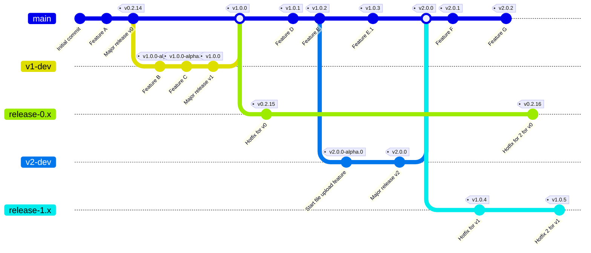

# 📦 RELEASE.md

This file documents how to safely version, tag, and publish the `@gov-cy/govcy-express-services` package to NPM and GitHub. It supports multiple version lines (`v0`, `v1`, etc.) and separates stable vs pre-release logic.

---

## ✅ Release Checklist

Before publishing a new version:

### 🔨 Development

- ⬜ Create a new branch: `git checkout -b v2-dev`  
- ⬜ Create or update all required code  
- ⬜ Write new unit tests for all new logic and components  
- ⬜ Run `npm run lint` and fix any style issues  
- ⬜ Commit with a clear message (e.g. `Release v1.0.0-alpha.2`)  

### 🚦 Testing

- ⬜ Manually test full flows (form submission, review, conditional pages, file uploads, etc.)  
- ⬜ Run local tests: `npm test`  
- ⬜ Confirm that CI passes (GitHub Actions: unit, integration, and functional tests)  

### 📦 Versioning & Changelog

- ⬜ Use `npm version` to bump the version:
  - ⬜ `npm version patch` / `minor` / `major`
  - ⬜ or `npm version prerelease --preid=alpha`  
- ⬜ Ensure `package.json` reflects the intended version  
- ⬜ Update `CHANGELOG.md` with a summary of key changes, if applicable  

### 🚀 Publishing

- ⬜ Run `git push origin HEAD --follow-tags` to trigger the correct GitHub Actions workflow  
- ⬜ Watch GitHub Actions to confirm:
  - ✅ NPM publish succeeded
  - ✅ GitHub release created (if tag pushed)
  - ✅ `src.zip` uploaded (if applicable)
- ⬜ Visit NPM and GitHub release pages to verify the published version and release notes  
- ⬜ If the release is stable, merge the branch into `main` and delete the feature branch.
---

## 🔢 Versioning Rules

| Level   | Use for                             |
| ------- | ----------------------------------- |
| `patch` | Bug fixes only                      |
| `minor` | Backward-compatible new features    |
| `major` | Breaking changes (e.g. file upload) |

Pre-releases use `-alpha.N`, `-beta.N`, etc. Example:

```bash
npm version prerelease --preid=alpha  # creates 1.0.0-alpha.0 → 1.0.0-alpha.1
```

---

## 🧠 Workflow Summary

| Branch        | Purpose                       | Workflow file                           | Publishes as |
| ------------- | ----------------------------- | --------------------------------------- | ------------ |
| `main`        | Stable line (`v1`, `v2`, ...) | `tag-and-publish-on-version-change.yml` | `latest`     |
| `release-0.x` | Maintains `v0.x` (Legacy patch line) | `tag-and-publish-legacy-and-dev.yml`            | `v0`         |
| `release-1.x` | Maintains `v1.x` (Legacy patch line) | `tag-and-publish-legacy-and-dev.yml`            | `v1`         |
| `v2-dev`      | Future version work           | `tag-and-publish-legacy-and-dev.yml`            | `v2`         |

### 📋 Versioning overview



----

## 📖 Legacy Versions (e.g. `release-0.x`)

Use this flow when you want to release:
- A patch or minor version to an older line (e.g. `v0.2.15`, `v1.1.0`)
- Without overriding the `latest` tag on NPM

### 1: Prepare the release
- Checkout the legacy branch, or create it if it doesn't exist:

```bash
git checkout -b release-0.x v0.2.14    # or release-1.x from v1.x latest
```
- Apply your fixes or features
    - Modify the code
    - Add unit tests
    - Test manually and via npm test
- Bump the version in `package.json`:

```bash
npm version 0.2.15     # or 1.0.1, etc.
```

### 2: Publish the tagged release
- Push the branch and tag to trigger the legacy workflow:

```bash
git push origin release-0.x
git push origin v0.2.15
```

Or if you're not pushing the branch:

```bash
git push origin HEAD --follow-tags
```

- The `tag-and-publish-legacy-and-dev.yml` workflow runs:
    - ✅ Publishes to NPM with --tag v0
    - ✅ Creates GitHub release
    - 🚫 Does not affect latest

### 3: Validate the release
- Check NPM:

```bash
npm view @gov-cy/govcy-express-services@0.2.15
```

- Check GitHub Releases:
    - Confirm release and `src.zip` asset appear

- (Optional) Deprecate older versions:

```bash
npm deprecate @gov-cy/govcy-express-services@0.2.14 "Replaced by v0.2.15"
```

## 🚀 Future Version (prerelease) e.g. `v1-dev`
Use this flow when you want to release:
- Work on a major version without overriding the `latest` tag on NPM

### 1.  Keep v0.2.14 as your current stable

- Tag it (if not already):
```bash
git tag v0.2.14
git push origin v0.2.14
```

### 2. Create a new development branch for `v1`
This is where you’ll work on the file input version:

```bash
git checkout -b v1-dev main
npm version 1.0.0-alpha.0
```
- Commit any changes (including file input support)
- Push the branch:

```bash
git push origin v1-dev
```

You’re now free to break things (safely).

### 3. When you're ready to test or publish a `v1` version

Create a tag **on the `v1-dev` branch**:

```bash
git tag v1.0.0-alpha.0
git push origin v1.0.0-alpha.0
```

- This will trigger your `tag-and-publish-legacy-and-dev.yml` (because it listens for `v1.*.*`)
- It will:
    - ✅ Publish to NPM with tag `v1`
    - ✅ Create a GitHub release
    - 🚫 Will NOT override `latest`

### 4. Your users can now do:

|Use case|Command|
|---|---|
|Continue using `v0` stable|`npm install @gov-cy/govcy-express-services@v0`|
|Try `v1` (file upload support)|`npm install @gov-cy/govcy-express-services@v1`|

### 5. When `v1` is ready to be the default

Later on, you do this:
1. Merge `v1-dev` into `main`
2. Run `npm version 1.0.0`
3. Push to `main`
4. Your **main workflow** will:
    - ✅ Create tags
    - ✅ Publish `v1.0.0` to NPM as `latest`

Now:
```bash
npm install @gov-cy/govcy-express-services  # installs v1.x
```
### Prelease summary
Use these commands to version and publish:

| Purpose                          | Command                                                                              |
| -------------------------------- | ------------------------------------------------------------------------------------ |
| Create new branch eg `v1-dev`    | `git checkout -b v1-dev main`                                               |
| Bump to next alpha               | `npm version prerelease --preid=alpha`                                               |
| Manually set prerelease          | `npm version 1.0.0-alpha.3`                                                          |
| Promote to stable                | `npm version 1.0.0`                                                                  |
| Bump patch/minor/major           | `npm version patch` / `minor` / `major`                                              |
| Release a legacy version         | `npm version 0.2.15`                                                                 |
| Push version + tag to trigger CI | `git push origin HEAD --follow-tags`                                                 |
| Tag manually (optional)          | `git tag v1.0.0-alpha.3 && git push origin v1.0.0-alpha.3`                           |
| Deprecate an old version         | `npm deprecate @gov-cy/govcy-express-services@1.0.0-alpha.0 "Deprecated prerelease"` |
| (Rare) Unpublish within 72h      | `npm unpublish @gov-cy/govcy-express-services@1.0.0-alpha.0`                         |

----

## 🧪 Testing a Tag

To test without affecting production users:

```bash
npm version 1.0.999-alpha.0
git push origin HEAD --follow-tags
```

You can later deprecate it:

```bash
npm deprecate @gov-cy/govcy-express-services@1.0.999-alpha.0 "Test version only. Do not use."
```

----

## 📎 Notes
- `latest` is only ever updated by the `main` branch workflow
- Users can install specific versions via:

```bash
npm install @gov-cy/govcy-express-services@v0
npm install @gov-cy/govcy-express-services@v1
npm install @gov-cy/govcy-express-services@1.0.0-alpha.2
```
- To avoid surprises, always check what’s already published:

```bash
npm view @gov-cy/govcy-express-services versions
```