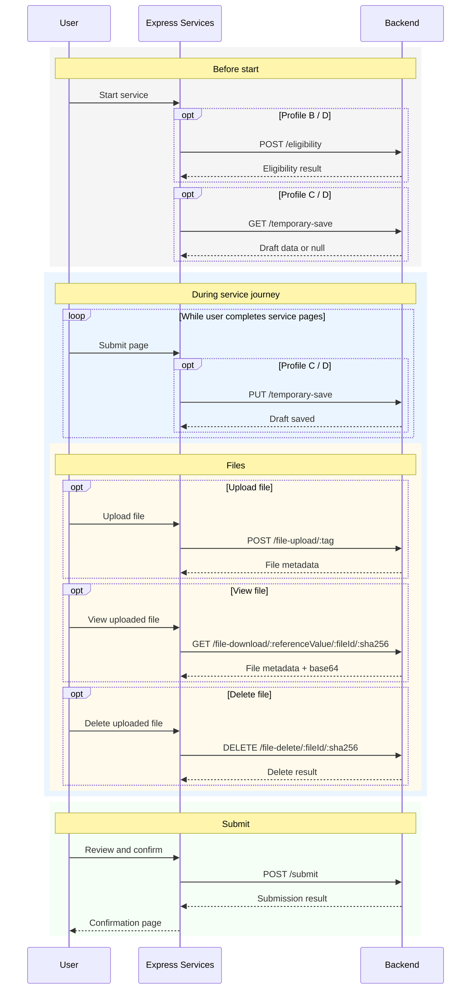

# Table of Contents

1. [Overview and Integration Profiles](#1-overview-and-integration-profiles) 
2. [Common Integration Rules](#2-common-integration-rules)  
3. [Endpoint Specifications](#3-endpoint-specifications)  
   - [Submission Endpoint](#31-submission-endpoint)  
   - [Eligibility Endpoint](#32-eligibility-endpoint)  
   - [Temporary Save (Retrieve)](#33-temporary-save-retrieve)  
   - [Temporary Save (Update)](#34-temporary-save-update)  
   - [File Upload Endpoint](#35-file-upload-endpoint)  
   - [File Download Endpoint](#36-file-download-endpoint)  
   - [File Delete Endpoint](#37-file-delete-endpoint)
4. [Submission Payload Structure](#4-submission-payload-structure)  
5. [Error Handling](#5-error-handling)
6. [Backend Conformance Checklist](#6-backend-conformance-checklist)

# 1. Overview and Integration Profiles

## 1.1 Purpose of this Document

This document defines the **backend integration specifications** for systems that integrate with **Express Services**.

Express Services is a framework used to build government digital services using a declarative service definition. During service execution, the framework interacts with external backend systems.

The Express Services Framework is responsible for:

- page rendering
- validation
- user journey
- session management

While **backend systems are responsible for:**

- eligibility checks
- data persistence (saving draft service data)
- business validation
- document storage (uploading and retrieving files)
- final submission processing

This specification defines the **expected behaviour, request structure, and response structure** for backend endpoints that support these operations.

The goal of this document is to ensure that backend systems can integrate with Express Services in a **consistent and predictable way**, regardless of the service being implemented.

This document focuses specifically on **backend system responsibilities** and does not describe the internal operation of the Express Services framework.

------

## 1.2 Audience

This specification is intended for:

- backend developers implementing APIs for Express Services
- integration architects designing service integrations
- technical teams responsible for backend systems used by government services

Readers of this document are expected to be familiar with:

- HTTP APIs
- JSON-based request and response payloads
- authentication using bearer tokens

------

## 1.3 Integration Profiles

Express Services supports different **integration profiles** depending on the capabilities required by a service.

Not all services require the full set of backend integrations. For example, some services may only submit data at the end of the service, while others may also require eligibility checks, draft saving, or file uploads.

Each profile defines a **set of backend endpoints that must be implemented**.

Services may implement one of the following profiles.

------

### 1.3.1 Profile A — Submission Only

This is the **minimum integration profile**.

The backend system only receives the final service submission once the user completes the service.

Required endpoint:

```http
POST /submit
```

Capabilities:

- receive completed service data
- validate the submission
- store or process the submission
- return success or business error responses

This profile is suitable for services that:

- do not require eligibility checks
- do not support temporary saving
- do not require file uploads

------

### 1.3.2 Profile B — Submission + Eligibility + Business Errors

This profile extends **Profile A** by adding an eligibility check before the user begins the service.

Required endpoints:

```http
POST /submit
POST /eligibility
```

Capabilities:

- check whether a user is eligible to start the service
- prevent ineligible users from continuing
- return business error codes during submission that may be mapped to service error pages

Typical use cases include:

- validating user eligibility based on backend data
- preventing duplicate applications
- validating backend records before allowing service access

------

### 1.3.3 Profile C — Submission + Temporary Save + File Handling

This profile extends **Profile A** by supporting **draft services** and **file uploads**.

Required endpoints:

```http
POST /submit
GET /temporary-save
PUT /temporary-save
POST /file-upload
GET /file-download
DELETE /file-delete
```

Capabilities:

- save draft service data while the user completes the service
- restore previously saved drafts
- upload supporting documents
- retrieve uploaded files
- delete uploaded files

Dependency rule:

File handling requires temporary save support because uploaded files are associated with draft service data.

------

### 1.3.4 Profile D — Full Integration

This profile supports **all available integration capabilities**.

Required endpoints:

```http
POST /submit
POST /eligibility
GET /temporary-save
PUT /temporary-save
POST /file-upload
GET /file-download
DELETE /file-delete
```

Capabilities:

- eligibility checks
- service submission
- draft services
- file uploads
- business error handling

This profile provides the full set of integration features supported by Express Services.

------

## 1.4 Service Execution Flow

The diagram below illustrates a typical interaction between **Express Services** and the **backend system** during a service journey.

> [!NOTE]  
> Not all services use all endpoints shown in this diagram.  
>
> The endpoints used depend on the selected [integration profile](#13-integration-profiles).



## 1.5 Endpoint Path Convention

This specification defines the **behaviour and contract** of each backend endpoint.

The actual endpoint URLs are **configurable per service** in Express Services.

For consistency, this document uses the following **example endpoint paths**:

```http
POST /submit
POST /eligibility
GET /temporary-save
PUT /temporary-save
POST /file-upload
GET /file-download
DELETE /file-delete
```

Backend systems may implement different endpoint paths provided that the configured service endpoints follow the **same request and response contract** defined in this specification.

For the full path of the URL follow [CY Connect's URI Naming Conventions](https://dev.azure.com/cyprus-gov-cds/Documentation/_wiki/wikis/Documentation/172/URI-Naming-Conventions).

------

# 2. Common Integration Rules

## 2.1 Communication, Authentication and Authorization

Backend systems should expose their APIs through [CY Connect](https://dev.azure.com/cyprus-gov-cds/Documentation/_wiki/wikis/Documentation/73/Overview).

Express Services calls backend APIs on behalf of an authenticated user.

For core backend integrations, Express Services forwards the user’s **CY Login access token** in the `Authorization` header using the bearer token format.

```http
Authorization: Bearer <access_token>
```

Backend systems must therefore be able to accept and validate bearer tokens and use the token to get the `unique_identifier` or `legal_unique_identifier` claims to identify the CY Login user. (see [CY Login's documentation on scopes and claims](https://dev.azure.com/cyprus-gov-cds/Documentation/_wiki/wikis/Documentation/82/Available-Scopes-and-Claims) and [CY Login Identity Matching Scenarios](https://dev.azure.com/cyprus-gov-cds/Documentation/_wiki/wikis/Documentation/60/Identity-Matching-Scenarios)) .

This specification does not mandate how the backend APIs validates the token internally. Validation may be handled by the backend system itself or by an API gateway.

See:

- [Endpoint configuration example](../README.md#submission-api-request-and-response)
- [CY Connect](https://dev.azure.com/cyprus-gov-cds/Documentation/_wiki/wikis/Documentation/73/Overview)
- [CY Login's documentation on scopes and claims](https://dev.azure.com/cyprus-gov-cds/Documentation/_wiki/wikis/Documentation/82/Available-Scopes-and-Claims)
- [CY Login Identity Matching Scenarios](https://dev.azure.com/cyprus-gov-cds/Documentation/_wiki/wikis/Documentation/60/Identity-Matching-Scenarios)

## 2.2 Required Request Headers

Unless otherwise stated in the endpoint-specific sections, Express Services uses the following common request headers for core backend integrations:

```http
Authorization: Bearer <access_token>
client-key: <clientKey>
service-id: <serviceId>
Accept: text/plain
```

These headers are explicitly documented for eligibility and temporary save requests, and the submission section follows the same integration model.

### Header definitions

- `Authorization`
   The authenticated user’s CY Login access token, sent as a bearer token.  Use the token to get the `unique_identifier` or `unique_identifier` claims to identify the CY Login user. (see [CY Login's documentation on scopes and claims](https://dev.azure.com/cyprus-gov-cds/Documentation/_wiki/wikis/Documentation/82/Available-Scopes-and-Claims)) 
- `client-key`
   The client identifier configured for the target backend endpoint. 
- `service-id`
   The service identifier configured for the target backend endpoint. 
- `Accept`
   For the core JSON APIs documented in the README, this is typically `text/plain`, even though the response body is expected to contain JSON. 
- `Content-Type`
   This depends on the endpoint:
  - `application/json` for JSON request bodies such as submission, eligibility `POST`, and temporary save `PUT` 
  - `multipart/form-data` for file upload requests 

## 2.3 Common Response Structure

All backend endpoints covered by this specification must return a **standard response envelope**.

This pattern is used throughout the framework documentation for eligibility checks, submission responses, and temporary save responses.

See:

- [Eligibility endpoint headers](../README.md#eligibility-api-request-and-response)
- [Submission endpoint headers](../README.md#submission-api-request-and-response)
- [Temporary save headers](../README.md#-temporary-save-feature)

### Standard response envelope

```
{
  "Succeeded": true,
  "ErrorCode": 0,
  "ErrorMessage": null,
  "Data": null
}
```

### Field definitions

| Field          | Description                               |
| -------------- | ----------------------------------------- |
| `Succeeded`    | Indicates whether the operation succeeded |
| `ErrorCode`    | Numeric code identifying a business error |
| `ErrorMessage` | Human-readable error description          |
| `Data`         | Optional payload returned by the endpoint |

### Normalization behaviour

The README states that Express Services **normalizes backend responses** to PascalCase keys (`Succeeded`, `ErrorCode`, `ErrorMessage`) regardless of the original response casing.

See:

- [Response normalization](../README.md#submission-api-request-and-response)

However, backend systems should return the canonical envelope directly to ensure a consistent integration contract.

## 2.4 Business Error Handling

Express Services distinguishes between:

- **technical failures** (API errors, invalid responses)
- **business rule failures**

Business rule failures should be returned using the standard response envelope.

Example:

```
{
  "Succeeded": false,
  "ErrorCode": 102,
  "ErrorMessage": "Duplicate application detected",
  "Data": null
}
```

Express Services will then check the service configuration to determine whether the returned `ErrorCode` is mapped to a specific service error page.

See:

- [Eligibility error handling](../README.md#eligibility-api-request-and-response)
- [Submission error handling](../README.md#submission-api-request-and-response)

If no mapping exists, the framework will display a generic error page.

## 2.5 HTTP Status Codes

The backend APIs typically return **HTTP 200** for both successful operations and business rule failures.

See:

- [Eligibility error handling](../README.md#eligibility-api-request-and-response)
- [Submission error handling](../README.md#submission-api-request-and-response)

### Recommended status codes

| Status                      | Meaning                                                      |
| --------------------------- | ------------------------------------------------------------ |
| `200 OK`                    | Request processed successfully (including business rule failures) |
| `400 Bad Request`           | Invalid request format                                       |
| `401 Unauthorized`          | Authentication failure                                       |
| `403 Forbidden`             | Caller not authorized                                        |
| `500 Internal Server Error` | Unexpected backend failure                                   |

Business errors that affect the user journey should normally return:

- `200 OK`
- `Succeeded: false`

## 2.6 File Validation Rules

File uploads are an **optional feature** and require temporary save to be enabled.

See:

- [Temporary save feature](../README.md#-temporary-save-feature)
- [File uploads feature](../README.md#%EF%B8%8F-files-uploads-feature)

The README specifies that file inputs support the following formats:

- PDF
- JPG
- JPEG
- PNG

### Backend expectations

Backend systems supporting file uploads should:

- accept uploads using `multipart/form-data`
- store uploaded files securely
- return file metadata required by Express Services

Typical metadata includes:

- `fileId`
- `fileName`
- `contentType`
- `fileSize`
- `sha256`
- `description`
- `tag`

See:

- [File upload response example](../README.md#fileuploadapiendpoint-post-api-request-and-response)

## 2.5 Scoping

When a request is made by an Express Service to an API endpoint, it references a specific service, user and submission instance, so API's must be scoped by **Service**, **User** and **Submission**. Make sure to distinguish these scopes withing your implementation. The scopes can be identified as follows:

- **Service** can be identified from the `client-key` or `service-id` (see [common request headers](#22-required-request-headers)). Alternatively the service can be identified by the `base path` of the endpoint URLs.  
- **User** can be identified through the CY Login user from the `access_token` (see [common request headers](#22-required-request-headers)).
- For the **submission**:
  - Before submission, Express Services Framework assumes that at any given time, **a user may have only one draft submission** and requires a consistent `reference number` for the draft submission for integration profiles C and D. The reference number must be unique for each submission.
  - After submission, Express Services Framework requires again a `reference number` that will be displayed to the users. This reference number should be connected with the submission on the back end system and should be the main method of identifying a submission. The reference number must be unique for each submission and it may be the same as the draft reference number but we require that the number is in Human Readable form.

------

# 3. Endpoint Specifications

This section defines the **backend API contract** for each integration endpoint supported by Express Services.

The actual endpoint URLs are **configurable per service**, as described in:

- [Endpoint path convention](#15-endpoint-path-convention)

Examples in this document use reference paths such as:

```http
POST /submit
```

Backend implementations may use different URLs as long as they follow the **same request and response contract**.

### Endpoint Summary

| Endpoint | Method | Profiles | Description |
|---|---|---|---|
| [Submission](#31-submission-endpoint) | POST | A,B,C,D | Receives final service submission |
| [Eligibility](#32-eligibility-endpoint) | POST | B,D | Determines if user can start service |
| [Temporary Save Retrieve](#33-temporary-save-retrieve) | POST / GET | C,D | Retrieves draft data |
| [Temporary Save Update](#34-temporary-save-update) | PUT | C,D | Saves draft data |
| [File Upload](#35-file-upload-endpoint) | POST | C,D | Upload supporting files |
| [File Download](#36-file-download-endpoint) | GET | C,D | Download uploaded file |
| [File Delete](#37-file-delete-endpoint) | DELETE | C,D | Delete uploaded file |

### 3.1 Submission Endpoint

#### 3.1.1 Purpose

The submission endpoint receives the **final service submission** once the user completes the service. 

The final service submission is considered an official communication from a citizen or a business with the government and it can be used for submitting an application, notification, express of interests and so on. 

Express Services collects all form data during the service journey and sends it to the configured submission endpoint when the user confirms the submission on the **review page**.

The submission can be scoped per `CY Login` user for each `Service` (these information can be gathered from the [request header](#22-required-request-headers)). Express Services does not make any assumptions about whether the user can submit only once, multiple times or only within a specific period. These checks should be made at the API and return [business error responses](#317-business-error-response) that can be mapped with error pages within the Express Framework. 

The framework documentation describing submission behaviour can be found in:

- [Site submissions](../README.md#-site-submissions)

#### 3.1.2 Integration Profiles

This endpoint is required for all integration profiles:

- Profile A — Submission only
- Profile B — Submission + Eligibility
- Profile C — Submission + Temporary Save + Files
- Profile D — Full integration

#### 3.1.3 Example Endpoint

```http
POST /submit
```

The actual endpoint URL is configured in the service definition.

See: 

- [Site submissions](../README.md#-site-submissions)

#### 3.1.4 Request Headers

Express Services sends the following headers when calling the submission endpoint.

```http
Authorization: Bearer <access_token>
client-key: <clientKey>
service-id: <serviceId>
Accept: text/plain
Content-Type: application/json
```

For the purpose of this specification, the backend must be able to resolve the draft submission 

- The `client-key` or `service-id` to identify the service 
- the CY Login user from the `access_token`.

Header definitions are described in:

- [Common request headers](#22-required-request-headers)

#### 3.1.5 Request example and body

**Example Request:**

```http
POST /submit HTTP/1.1
Host: localhost:3002
Authorization: Bearer eyJhbGciOi...
client-key: 12345678901234567890123456789000
service-id: 123
Accept: text/plain
Content-Type: application/json

{
  "submissionUsername": "username",
  "submissionEmail": "email@example.com",
  "submissionData": "{\"index\":{\"certificate_select\":[\"birth\",\"permanent_residence\"]}}",
  "submissionDataVersion": "1"
}
```

The submission endpoint receives a JSON payload containing the completed service data.

The **structure of the body** is explained in detail in chapter [4. Submission Payload Structure](#4-submission-payload-structure).

#### 3.1.6 Success Response

When the submission is successfully processed, the backend must return the standard response envelope.

Example:

```http
HTTP/1.1 200 OK

{
  "Succeeded": true,
  "ErrorCode": 0,
  "ErrorMessage": null,
  "Data": {
    "referenceValue": "12345678"
  }
}
```

The returned `referenceValue` is used by the service to display confirmation information to the user. This reference number should be connected with the submission on the back end system and should be the main method of identifying a submission. The reference number must be unique for each submission and it **must be in Human Readable form**.

#### 3.1.7 Business Error Response

If the backend determines that the submission fails a **business rule**, the endpoint should return a business error using the standard response envelope.

Example:

```http
HTTP/1.1 200 OK

{
  "Succeeded": false,
  "ErrorCode": 102,
  "ErrorMessage": "sick leave already submitted for the applied period"
}
```

Express Services will check whether the returned `"Succeeded": false` and the `ErrorCode` is mapped to a service error page. This allows the service to display an appropriate error page.

See:

- [Business error handling](../README.md#submission-api-request-and-response)

If a matching error mapping exists in the service configuration, the user will be redirected to the configured error page.

If no mapping exists, the framework displays a generic error page.

------

### 3.2 Eligibility Endpoint

#### 3.2.1 Purpose

The eligibility endpoint determines whether a user is **allowed to use a service**.

When eligibility checks are configured, Express Services calls the eligibility endpoint before allowing the user to begin the service journey.

- If the user is eligible, the service continues normally.

- If the user is not eligible, the framework redirects the user to the configured error page.

The draft eligibility checks can be scoped per `CY Login` user for each `Service` (these information can be gathered from the [request header](#22-required-request-headers)), so they are ideal for checking if a user is eligible for a service. 

Express services does not make any assumptions about whether the user can use the service only once, multiple times or only within a specific period. These checks should be made by the API and return [business error responses](#327-business-error-response) that can be mapped with error pages within the Express Framework. 

The eligibility feature is described in the framework documentation:

See:

- [Site eligibility checks](../README.md#%EF%B8%8F-site-eligibility-checks)

#### 3.2.2 Integration Profiles

The eligibility endpoint is required for the following integration profiles:

- Profile B — Submission + Eligibility
- Profile D — Full integration

#### 3.2.3 Example Endpoint

The request can either be a `POST` or a `GET` for example:

```http
POST /eligibility
```

Or

```http
GET /eligibility?checkFor=isCitizen,isAdult
```

The actual endpoint URL is configured in the service definition. 

> [!NOTE]  
> A service might have more that one eligibility checks but we advice that all checks are made through one API to reduce network time. 

See:

- [Eligibility endpoint configuration](../README.md#eligibility-api-request-and-response)

#### 3.2.4 Request Headers

Express Services sends the following headers when calling the eligibility endpoint.

```http
Authorization: Bearer <access_token>
client-key: <clientKey>
service-id: <serviceId>
Accept: text/plain
Content-Type: application/json
```

For the purpose of this specification, the backend must be able to resolve the draft submission 

- The `client-key` or `service-id` to identify the service 
- the CY Login user from the `access_token`.

Header definitions are described in:

- [Common request headers](#22-required-request-headers)

#### 3.2.5 Request example and body

**Example GET Request:**

```http
GET /eligibility?checkFor=isCitizen,isAdult HTTP/1.1
Host: localhost:3002
Authorization: Bearer eyJhbGciOi...
client-key: 12345678901234567890123456789000
service-id: 123
Accept: text/plain
```

**Example POST Request**:

```http
POST /eligibility HTTP/1.1
Host: localhost:3002
Authorization: Bearer eyJhbGciOi...
client-key: 12345678901234567890123456789000
service-id: 123
Accept: text/plain
Content-Type: application/json

{
  "checkFor": "isCitizen,isAdult"
}
```

The eligibility endpoint receives a JSON payload containing information about the check. 

The parameters and method of the request are configured in the service definition of the Express service. 

Additional information may be included depending on the service configuration.

See:

- [Eligibility request structure](../README.md#eligibility-api-request-and-response)

#### 3.2.6 Success Response

If the user **is eligible** to start the service, the backend should return a successful response.

Example:

```http
HTTP/1.1 200 OK

{
  "Succeeded": true,
  "ErrorCode": 0,
  "ErrorMessage": null,
}
```

Express Services will then allow the user to continue the service journey.

#### 3.2.7 Business Error Response

If the user is **not eligible**, the backend should return a business error using the standard response envelope, with HTTP status code `200`.

Example:

```http
HTTP/1.1 200 OK

{
  "Succeeded": false,
  "ErrorCode": 101,
  "ErrorMessage": "user not a teacher"
}
```

Express Services will check the service configuration to determine whether the returned `ErrorCode` is mapped to a specific error page.

> [!NOTE]  
> The same eligibility endpoint can return different `ErrorCodes` depending on the check that failed. For example:
>
> - 101: user not a teacher
> - 102: user already applied 
> - 103: user prerequisite not met
>
> Only one `ErrorCode` is returned for each request, even if the user is not eligible for other reasons as well. 

See:

- [Business error handling](../README.md#eligibility-api-request-and-response)

If a matching error mapping exists, the user will be redirected to the configured page. Otherwise, a generic error page will be displayed.

------

### 3.3 Temporary Save (Retrieve)

#### 3.3.1 Purpose

The temporary save retrieve endpoint is used to load a previously saved draft submission for the current user and service.

When temporary save is enabled, Express Services calls this endpoint on the first page load of the service. If draft data is found, the framework restores that data into the session so that form fields are pre-filled when the user returns to the service.

If no draft data is found, the framework may proceed to create a new temporary save record using the [temporary save update endpoint](#34-temporary-save-update).

The draft submission data records should be scoped per `CY Login` user for each `Service` (these information can be gathered from the [request header](#22-required-request-headers)). Express Services assumes that at any given time, only one draft submission exists for this scope.

See:

- [Temporary save feature](../README.md#-temporary-save-feature)
#### 3.3.2 Integration Profiles

This endpoint is required for the following integration profiles:

- Profile C — Submission + Temporary Save + File Handling
- Profile D — Full Integration

#### 3.3.3 Example Endpoint

```http
GET /temporary-save
```

The actual endpoint URL is configured in the service definition through `submissionGetAPIEndpoint`.

See:

- [How to enable and configure temporary save](../README.md#-temporary-save-feature)
- [Temporary save GET API request and response](../README.md#submissiongetapiendpoint-get-api-request-and-response)

#### 3.3.4 Request Headers

Express Services sends the following headers when calling the temporary save retrieve endpoint.

```http
Authorization: Bearer <access_token>
client-key: <clientKey>
service-id: <serviceId>
Accept: text/plain
Content-Type: application/json
```

For the purpose of this specification, the backend must be able to resolve the draft submission 

- The `client-key` or `service-id` to identify the service 
- the CY Login user from the `access_token`.

Header definitions are described in:

- [Common request headers](#22-required-request-headers)

#### 3.3.5 Request example

**Example Request:**

```http
GET /temporary-save HTTP/1.1
Host: localhost:3002
Authorization: Bearer eyJhbGciOi...
client-key: 12345678901234567890123456789000
service-id: 123
Accept: text/plain
Content-Type: application/json
```

The retrieve endpoint is a `GET` request.

See:

- [Temporary save GET API request and response](../README.md#submissiongetapiendpoint-get-api-request-and-response)

#### 3.3.6 Success Response

If saved draft data is found, the backend must return the standard response envelope with a `Data` object containing:

- `submissionData`
- `referenceValue`

> [!IMPORTANT]  
> Do not alter the structure of the `submissionData` in any way. Express Services follows a specific structure, so altering it will break the Temporary save feature. Just return the data as they are store by the [Temporary Save (Update) endpoint](#34-temporary-save-update).

Example:

```http
HTTP/1.1 200 OK

{
    "Succeeded": true,
    "ErrorCode": 0,
    "ErrorMessage": null,
    "Data": {
        "submissionData": "{\"index\":{\"formData\":{\"certificate_select\":[\"birth\",\"permanent_residence\"]}},\"page-2\":{\"formData\":{\"mobile_select\":\"other\",\"mobileTxt\":\"+35799484967\"}}}",
        "referenceValue": "0000000924107836"
    }
}
```

The `submissionData` field contains the previously saved draft submission data as a JSON string.

The `referenceValue` is the unique identifier of the draft submission. It is important because it is later used by the file download endpoint

See:

- [Temporary save GET API request and response](../README.md#submissiongetapiendpoint-get-api-request-and-response)

#### 3.3.7 Response When No Draft Exists

If no temporary save record exists for the current user and service, the backend should return a successful response, with HTTP status code `404` and `Data: null`.

Example:

```http
HTTP/1.1 404 Not Found

{
    "Succeeded": true,
    "ErrorCode": 0,
    "ErrorMessage": null,
    "Data": null
}
```

For this specification, the important contract is:

- HTTP status code is `404`
- `Succeeded` is `true`
- `Data` is `null`

See:

- [Temporary save GET API request and response](../README.md#submissiongetapiendpoint-get-api-request-and-response)

#### 3.3.8 Failure Response

If retrieval fails due to an authentication problem, backend error, or another operational issue, the endpoint should return the standard failure envelope.

Example:

```http
HTTP/1.1 200 OK

{
    "Succeeded": false,
    "ErrorCode": 401,
    "ErrorMessage": "Not authorized",
    "Data": null
}
```

If the request fails or the response is invalid, Express Services should treat this as a technical failure rather than as “no draft found”.

See:

- [Temporary save GET API request and response](../README.md#submissiongetapiendpoint-get-api-request-and-response)

#### 3.3.9 Notes

- This endpoint is optional and is only used when temporary save is configured.
- If `submissionGetAPIEndpoint` is not defined, Express Services skips temporary save retrieval entirely.
- Existing services continue to work without modification when temporary save is not enabled.
- The response is normalized by the framework to PascalCase keys, but backend systems should return the canonical PascalCase envelope directly.

See:

- [Temporary save backward compatibility](../README.md#temporary-save-backward-compatibility)

------

### 3.4 Temporary Save (Update)

#### 3.4.1 Purpose

The temporary save update endpoint is used to **create or update a draft submission** while the user is completing a service before the final submission.

Express Services calls this endpoint when temporary save is enabled and the user submits data during the service journey.

The endpoint allows the backend system to:

- create a new draft submission record
- update an existing draft submission
- persist partial service data during the user journey

The draft submission data records should be scoped per `CY Login` user for each `Service` (these information can be gathered from the [request header](#22-required-request-headers)). Express Services assumes that at any given time, only one draft submission exists for this scope.

The temporary save feature is described in the framework documentation:

See:

- [Temporary save feature](../README.md#-temporary-save-feature)

#### 3.4.2 Integration Profiles

This endpoint is required for the following integration profiles:

- Profile C — Submission + Temporary Save + File Handling
- Profile D — Full Integration

#### 3.4.3 Example Endpoint

```http
PUT /temporary-save
```

The actual endpoint URL is configured in the service definition through `submissionPutAPIEndpoint`.

See:

- [Temporary save configuration](../README.md#submissionputapiendpoint-put-api-request-and-response)

#### 3.4.4 Request Headers

Express Services sends the following headers when calling the temporary save update endpoint.

```http
Authorization: Bearer <access_token>
client-key: <clientKey>
service-id: <serviceId>
Accept: text/plain
Content-Type: application/json
```

For the purpose of this specification, the backend must be able to resolve the draft submission 

- The `client-key` or `service-id` to identify the service 
- the CY Login user from the `access_token`.

Header definitions are described in:

- [Common request headers](#22-required-request-headers)

#### 3.4.5 Request example and body

**Example Request:**

```http
PUT /temporary-save HTTP/1.1
Host: localhost:3002
Authorization: Bearer eyJhbGciOi...
client-key: 12345678901234567890123456789000
service-id: 123
Accept: text/plain
Content-Type: application/json

{
  "submissionData" : "{\"index\":{\"formData\":{\"certificate_select\":[\"birth\",\"permanent_residence\"]}},\"page-2\":{\"formData\":{\"mobile_select\":\"other\",\"mobileTxt\":\"+35799484967\"}}}"
}
```

The update endpoint receives a JSON payload containing the serialized draft submission data (`submissionData`)

> [!IMPORTANT]  
> Do not alter the structure of the `submissionData` when storing it in any way. Express Services follows a specific structure, so altering it will break the Temporary save feature.

Example request body:

```json
{
    "submissionData": "{\"index\":{\"formData\":{\"certificate_select\":[\"birth\",\"permanent_residence\"]}},\"page-2\":{\"formData\":{\"mobile_select\":\"other\",\"mobileTxt\":\"+35799484967\"}}}"
}
```

Important notes:

- `submissionData` contains the current state of the service form data.
- The value is sent as a **JSON string**, not as a nested JSON object.

If no draft submission is stored for the said `CY Login` user for the specific `service`, the backend should create a new draft submission.

See:

- [Temporary save PUT API request and response](../README.md#submissionputapiendpoint-put-api-request-and-response)

#### 3.4.6 Success Response

When the draft submission is successfully created or updated, the backend must return the standard response envelope.

Example:

```http
HTTP/1.1 200 OK

{
    "Succeeded": true,
    "ErrorCode": 0,
    "ErrorMessage": null,
    "Data": {
        "submissionData": "{\"index\":{\"formData\":{\"certificate_select\":[\"birth\",\"permanent_residence\"]}},\"page-2\":{\"formData\":{\"mobile_select\":\"other\",\"mobileTxt\":\"+35799484967\"}}}",
        "referenceValue": "0000000924107836"
    }
}
```

The returned `referenceValue` represents the unique identifier of the draft submission.

This identifier must remain stable across the lifecycle of the draft and will later be used by the file upload and file download.

See:

- [Temporary save PUT API request and response](../README.md#submissionputapiendpoint-put-api-request-and-response)

#### 3.4.7 Business Error Response

If the backend determines that the draft update fails a business rule, the endpoint should return the standard failure envelope.

Example:

```http
HTTP/1.1 401 Unauthorized

{
    "Succeeded": false,
    "ErrorCode": 401,
    "ErrorMessage": "Not authorized",
    "Data": null
}
```

Express Services will treat this response as a business failure.

See:

- [Business error handling](../README.md#submissionputapiendpoint-put-api-request-and-response)

#### 3.4.8 Notes

- This endpoint is only used when temporary save is enabled.
- If `submissionPutAPIEndpoint` is not defined in the service configuration, Express Services will not attempt to save draft submissions.
- Draft data should be stored in a way that allows subsequent retrieval through the temporary save retrieve endpoint.

See:

- [Temporary save configuration](../README.md#submissionputapiendpoint-put-api-request-and-response)

------

### 3.5 File Upload Endpoint

#### 3.5.1 Purpose

The file upload endpoint is used to **upload supporting documents** during the service journey before the final submission.

When a page includes a `fileInput` element, Express Services sends uploaded files to the configured file upload endpoint. The backend system is responsible for storing the uploaded file and returning metadata describing the stored file.

> [!NOTE]  
> The file upload endpoints are used during the service journey NOT on the submission endpoint. The submission endpoint simply passes the `fileId` and `sha256` values in the [submissionData](#41-submissiondata-structure). 

>[!IMPORTANT]
>Deleting a file is done using the `fileId` and `sha256`. If the same file is used for other fields, it will be removed from all instances in the data layer. A warning will appear in the user's delete confirmation page to warn the users in such cases.
>
>As the same file may be used for different user, service, field or submission, make sure that you provide a different `fileId` depending on the scope. 

Uploaded files are associated with the **current draft submission** and therefore with the same scope used by the Temporary Save feature.

The uploaded files should therefore be scoped per:

- `CY Login` user
- `Service`
- draft submission

These values can be resolved using the information provided in the [request header](#354-request-headers) and [request body](#355-request-example).

The Temporary save feature must be enabled for the file uploads feature to work.

The file upload feature is described in the framework documentation:

See:

- [File uploads](../README.md#fileuploadapiendpoint-post-api-request-and-response)

#### 3.5.2 Integration Profiles

This endpoint is required for the following integration profiles:

- Profile C — Submission + Temporary Save + File Handling
- Profile D — Full Integration

#### 3.5.3 Example Endpoint

```http
POST /file-upload/:tag
```

> [!NOTE]  
> The URL is concatenated with `/:tag` which defines the type of the file (for example `passport`). For example `https://example.com/api/file-upload/:tag`

The actual endpoint URL is configured in the service definition through `fileUploadAPIEndpoint`.

See:

- [File upload endpoint configuration](../README.md#fileuploadapiendpoint-post-api-request-and-response)

#### 3.5.4 Request Headers

Express Services sends the following headers when calling the file upload endpoint.

```http
Authorization: Bearer <access_token>
client-key: <clientKey>
service-id: <serviceId>
Accept: text/plain
Content-Type: multipart/form-data
```

> [!NOTE]  
> Use `Content-Type: multipart/form-data`

For the purpose of this specification, the backend must be able to resolve the draft submission 

- The `client-key` or `service-id` to identify the service 
- the CY Login user from the `access_token`.

Header definitions are described in:

- [Common request headers](#22-required-request-headers)

#### 3.5.5 Request example

The file upload endpoint receives a `multipart/form-data` request containing the uploaded file and metadata describing the file.

Example curl request:

```bash
curl -X POST --location 'https://example.gov.cy/api/v1/file-upload/passport' \
--header 'client-key: 12345678901234567890123456789000' \
--header 'service-id: 123' \
--header 'Authorization: Bearer eyJhbGciOi...' \
--form 'file=@"/path/to/file.pdf"'
```

See:

- [File upload endpoint configuration](../README.md#fileuploadapiendpoint-post-api-request-and-response)

#### 3.5.6 Success Response

When the file is successfully uploaded, the backend must return the standard response envelope containing metadata describing the stored file.

Example:

```http
HTTP/1.1 200 OK

{
    "ErrorCode": 0,
    "ErrorMessage": null,
    "Data": {
        "fileId": "6899adac8864bf90a90047c3",
        "fileName": "passport.pdf",
        "contentType": "application/pdf",
        "fileSize": 4721123,
        "sha256": "8adb79e0e782280dad8beb227333a21796b8e01d019ab1e84cfea89a523b0e7d",
        "description": "passport.pdf",
        "tag": "passport"
    },
    "Succeeded": true
}
```

The returned metadata must allow the framework to later:

- display uploaded files in the user interface
- [download](#36-file-download-endpoint) the file
- [delete](#37-file-delete-endpoint) the file
- reference the file when submitting in the [submissionData](#41-submissiondata-structure) using the returned `fileId` and `sha256`

See: 

- [File upload endpoint configuration](../README.md#fileuploadapiendpoint-post-api-request-and-response)

#### 3.5.7 Failure Response

If the file upload fails due to a business rule (for example, file type restrictions or file size limits), authentication issues or backend errors, the backend should return the standard failure envelope.

Example:

```http
HTTP/1.1 400

{
  "ErrorCode": 400,
  "ErrorMessage": "SUBMISSION_REQUIRED",
  "Data": null,
  "Succeeded": false
}
```

Express Services will treat this as a technical failure.

See:

- [File upload request and response](../README.md#fileuploadapiendpoint-post-api-request-and-response)

#### 3.5.8 Notes

- File uploads require the Temporary Save feature to be enabled.
- Uploaded files must later be retrievable using the file download endpoint.

------

### 3.6 File Download Endpoint

#### 3.6.1 Purpose

The file download endpoint is used to **download a previously uploaded file** during the service journey.

When a user clicks `View` for an uploaded file, Express Services calls the configured file download endpoint and opens the returned file in a new tab. The backend system is responsible for locating the uploaded file and returning its metadata together with the file contents in Base64 format. The README describes this flow as part of the files upload feature. 

>[!NOTE]
> The file download endpoint is used during the service journey and on the review page. It is not used by the submission endpoint. The submission endpoint only passes the `fileId` and `sha256` values inside the `submissionData`.

The uploaded files should therefore be scoped per:

- `CY Login` user
- `Service`
- `referenceValue` of the draft submission
- file using the `fileId` and `sha256`

These values can be resolved using the information provided in the [request header](#364-request-headers), request URL parameters in the endpoint URL (which uses `referenceValue`, `fileId`, and `sha256`).

The Temporary save feature must be enabled for the file uploads feature to work. 

The file download feature is described in the framework documentation:

See:

- [File downloads](../README.md#filedownloadapiendpoint-get-api-request-and-response)

#### 3.6.2 Integration Profiles

This endpoint is required for the following integration profiles:

- Profile C — Submission + Temporary Save + File Handling
- Profile D — Full Integration

#### 3.6.3 Example Endpoint

```http
GET /file-download/:referenceValue/:fileid/:sha256
```

>[!NOTE]
>The URL is concatenated with `/:referenceValue/:fileid/:sha256`. For example `https://example.com/api/file-download/1234567890/123456789123456/12345678901234567890123`. The README defines:
>
> - `referenceValue` as the `referenceValue` of the current temporary saved instance
> - `fileid` as the `fileId` of the uploaded file
> - `sha256` as the `sha256` of the uploaded file 

The actual endpoint URL is configured in the service definition through `fileDownloadAPIEndpoint`.

See:

- [File download endpoint configuration](../README.md#filedownloadapiendpoint-get-api-request-and-response)

#### 3.6.4 Request Headers

Express Services sends the following headers when calling the file download endpoint.

```http
Authorization: Bearer <access_token>
client-key: <clientKey>
service-id: <serviceId>
Accept: text/plain
Content-Type: application/json
```

For the purpose of this specification, the backend must be able to resolve the draft submission

- The `client-key` or `service-id` to identify the service
- the CY Login user from the `access_token`.

Header definitions are described in:

- [Common request headers](#22-required-request-headers)

#### 3.6.5 Request example

The file download endpoint is a `GET` request and receives the file identifiers through the URL.

**Example Request:**

```http
GET /file-download/1234567890/123456789123456/12345678901234567890123 HTTP/1.1
Host: localhost:3002
Authorization: Bearer eyJhbGciOi...
client-key: 12345678901234567890123456789000
service-id: 123
Accept: text/plain
Content-Type: application/json
```

See:

- [File download request and response](../README.md#filedownloadapiendpoint-get-api-request-and-response)

#### 3.6.6 Success Response

When the file is found, the backend must return the standard response envelope containing the file metadata and the file data in Base64.

Example:

```http
HTTP/1.1 200 OK

{
  "ErrorCode": 0,
  "ErrorMessage": null,
  "Data": {
    "fileId": "123456789123456",
    "fileName": "passport.pdf",
    "contentType": "application/pdf",
    "fileSize": 1872,
    "sha256": "12345678901234567890123456789012345678901234567890123456789012345",
    "base64": "JVBERi0xLjMKJZOMi54gUm....",
    "description": null,
    "uid": null,
    "tag": "Passport"
  },
  "Succeeded": true
}
```

The returned metadata and `base64` value allow Express Services to open the uploaded file for the user. The README explicitly states that this endpoint returns the file data in Base64. 

See:

- [File download request and response](../README.md#filedownloadapiendpoint-get-api-request-and-response)

#### 3.6.7 Failure Response

If the file is not found, the backend should return the failure response.

Example:

```http
HTTP/1.1 404 Not Found

{
    "ErrorCode": 404,
    "ErrorMessage": "File not found",
    "InformationMessage": null,
    "Data": null,
    "Succeeded": false
}
```

Express Services will treat this as a technical failure.

See:

- [File download request and response](../README.md#filedownloadapiendpoint-get-api-request-and-response)

#### 3.6.8 Notes

- File downloads require the Temporary Save feature to be enabled. 
- The file is identified by the combination of `referenceValue`, `fileId`, and `sha256`and is scoped with `CY Login user` and `Service`. 
- The response includes the file data in Base64. 

------

### 3.7 File Delete Endpoint

#### 3.7.1 Purpose

The file delete endpoint is used to **delete a previously uploaded file** during the service journey.

When a user clicks `Delete` for an uploaded file, Express Services first displays a confirmation page. If the user confirms the deletion, Express Services calls the configured file delete endpoint. If the deletion succeeds, the file is removed from the data layer and the `fileView` element is removed from the page. If the same file is used on another page with the same `fileId` and `sha256`, it is also removed from the data layer. 

>[!NOTE]
>The file delete endpoint is used during the service journey. It is not used by the submission endpoint. The submission endpoint only passes the `fileId` and `sha256` values inside the `submissionData`. 

>[!IMPORTANT]
>If the same file (same `fileId` and `sha256`) is used for other fields, when deleted it will be removed from all instances in the data layer. A warning will appear in the user's delete confirmation page to warn the users in such cases. 

Uploaded files are associated with the same overall scope used by the Temporary Save feature and file handling flow.

The file delete feature is described in the framework documentation:

See:

- [File delete request and response](../README.md#filedeleteapiendpoint-delete-api-request-and-response)

#### 3.7.2 Integration Profiles

This endpoint is required for the following integration profiles:

- Profile C — Submission + Temporary Save + File Handling
- Profile D — Full Integration

#### 3.7.3 Example Endpoint

```http
DELETE /file-delete/:fileid/:sha256
```

>[!NOTE]
>The URL is concatenated with `/:fileid/:sha256`. For example `https://example.com/api/file-delete/123456789123456/12345678901234567890123`
>
>- `fileid` is the `fileId` of the file uploaded by the user
>- `sha256` is the `sha256` of the file uploaded by the user 

The actual endpoint URL is configured in the service definition through `fileDeleteAPIEndpoint`.

See:

- [File delete endpoint configuration](../README.md#filedeleteapiendpoint-delete-api-request-and-response)

#### 3.7.4 Request Headers

Express Services sends the following headers when calling the file delete endpoint.

```http
Authorization: Bearer <access_token>
client-key: <clientKey>
service-id: <serviceId>
Accept: text/plain
Content-Type: application/json
```

For the purpose of this specification, the backend must be able to resolve the draft submission

- The `client-key` or `service-id` to identify the service
- the CY Login user from the `access_token`.

Header definitions are described in:

- [Common request headers](#22-required-request-headers)

#### 3.7.5 Request example

The file delete endpoint is a `DELETE` request and receives the file identifiers through the URL.

**Example Request:**

```http
DELETE file-delete/123456789123456/12345678901234567890123 HTTP/1.1
Host: localhost:3002
Authorization: Bearer eyJhbGciOi...
client-key: 12345678901234567890123456789000
service-id: 123
Accept: text/plain
Content-Type: application/json
```

See:

- [File delete request and response](../README.md#filedeleteapiendpoint-delete-api-request-and-response)

#### 3.7.6 Success Response

When the file is found and deleted, the backend must return the standard response envelope.

Example:

```http
HTTP/1.1 200 OK

{
  "ErrorCode": 0,
  "ErrorMessage": null,
  "Succeeded": true
}
```

See:

- [File delete request and response](../README.md#filedeleteapiendpoint-delete-api-request-and-response)

#### 3.7.7 Failure Response

If the file is not found, the backend should return the failure response shown in the README.

Example:

```http
HTTP/1.1 404 Not Found

{
  "ErrorCode": 404,
  "ErrorMessage": "File not found",
  "InformationMessage": null,
  "Data": null,
  "Succeeded": false
}
```

Express Services will treat this as a technical failure.

See:

- [File delete request and response](../README.md#filedeleteapiendpoint-delete-api-request-and-response)

#### 3.7.8 Notes

- File deletes require the Temporary Save feature to be enabled as part of the file uploads feature flow. 
- The file is identified by the combination of `fileId` and `sha256`. 
- If the same file is used in multiple places, deleting it removes all those instances from the data layer. 

------

# 4. Submission Payload Structure

The [submission endpoint](#3.1-submission-endpoint) receives a JSON payload that contains **submission metadata** together with the **actual service data** collected during the user journey.

The fields `submissionUsername` and `submissionEmail` identify the user submitting the service. The `submissionData` field contains the **entire form data captured by Express Services**, encoded as a JSON string. This structure allows the framework to transmit the complete state of the service form while keeping the outer request payload stable across different services.

The structure of `submissionData` is determined by the service definition and the pages defined in the service configuration. The detailed structure and rules for this payload are described in [Section 4.1 submissionData structure](#41-submissiondata-structure).

The request body structure:

```json
{
  "submissionUsername" : "",
  "submissionEmail" : "",
  "submissionData": "{}",
  "submissionDataVersion": ""          
}
```

| **Field name**        | **Type** | **Required** | **Description**                                              |
| --------------------- | -------- | ------------ | ------------------------------------------------------------ |
| submissionUsername    | string   | Yes          | Username of the person  submitting the form.                 |
| submissionEmail       | string   | Yes          | Email address of the  submitter.                             |
| submissionData        | string   | Yes          | JSON-encoded and escaped string  containing the submission payload. More details in [4.1 submissionData structure](#41-submissiondata-structure). |
| submissionDataVersion | string   | Yes          | Version of the  submissionData schema. Used for backward compatibility and parsing logic. |

> [!NOTE]  
> The body's object may contain more details such as `printFriendlyData` or `rendererVersion` which should be ignored.

The exact structure of `submissionData` depends on the service definition and the elements used in the service pages.

## 4.1 submissionData structure

The submissionData is an encoded and escaped string of a JSON object containing all user-provided data for a submission (the submission payload).

**Example: submissionData (decoded)**

```json
{
   "book-title": {
      "bookTitle": "Service design the DSF way",
      "bookSubTitle": "",
      "bookParalelTitle": "",
      "needsAuthorization": "yes",
      "authorizationAttachment": {
         "sha256": " f9fc22c8d439b9084db543d473443d23e10...",
         "fileId": " 698b53051e3dc472..."
      }
   },
   "publishing-details": {
      "selfPublished": "fromPublisher",
      "publisherName": "Mister Publisher",
      "address": "2 Some street",
      "email": "email@test.com",
      "mobile": "+35799123456",
      "address": "SOME STREET  11A  \\n2311 LAKATAMIA\\nNICOSIA\\nCYPRUS"
   },
   "authors": [
      {
         "isPerson": "person",
         "authorName": "Author",
         "authorLastName": "Mc Author",
         "pseudoName": "",
         "birthYear": "1920",
         "idArc": "1234567",
         "nationality": "CY",
         "address": "Some street",
         "email": "test@email.com",
         "mobile": "0012345679",
         "groupName": ""
      }
   ],
   "book-series": {
      "isSeries": "yes",
      "seriesTitle": "Good designs by DSF",
      "seriesNo": "2",
      "seriesInCharge": ""
   },
   "physical-description": {
      "bookPrintForm": [
         "printPaperTight",
         "printHardTight"
      ],
      "bookDimensions": "11 x 30 cm",
      "bookPages": "245",
      "bookVolumes": "1",
      "bookAditionalMaterial": "",
      "bookPricePaperTight": "123,45",
      "bookPriceHardTight": "143,45"
   },
   "editors": [
      {
         "editorName": "Editor One",
         "birthYear": "1913",
         "nationality": "CY",
         "address": "",
         "mobile": "99123456"
      },
      {
         "editorName": "Editor 2",
         "birthYear": "1920",
         "nationality": "DJ",
         "address": "",
         "mobile": "991234567"
      }
   ],
   "illustrators": [],
   "options": {
      "wantBarcode": "no",
      "wantCataloguing": "yes",
      "sendtoInt": "no"
   }
}

```

**Overall rules**

- The **first level** of the object represents **pages/sections** of the service.
- Each section **always exist and always follow the same schema**, regardless of user input.
- Empty or unanswered values **are explicitly represented**, not omitted.
- The structure (keys, nesting, data types) **do not change between submissions** of the **same version**.

This means:

- No fields are omitted
- No pages/sections are removed
- Empty answers are explicitly represented using:
  - `""` for *strings* and *files*
  - `[]` for *arrays*
- Arrays exist even when they contain no items
- Field names and data types are not changed

> [!IMPORTANT]  
> `submissionData` is a **string** containing a **JSON-encoded** representation of the submission payload.
>
> Express JSON-encodes the inner object before sending.

### 1st level: Pages/Sections

- Each top-level key represents a **page or a section** of the Express Service
- Section keys are strings (usually kebab-case).
- A section value can be:
  - an **object**, or
  - an **array of objects** (for repeatable sections)

Example:

```json
"book-title": { ... },
"authors": [ ... ],
"illustrators": []
```

#### 1st level Object type

Used for non-repeatable objects 

**Rules**

- Type: `<object>`
- Objects in all submissions follow the **same internal structure**
- Empty value: Object with empty values
- All expected fields inside each object exist, even if empty

Example of non-empty object:

```json
"publishing-details": {
  "selfPublished": "fromPublisher",
  "publisherName": "Mister Publisher",
  "address": "2 Some street",
  "email": "email@test.com",
  "mobile": "+35799123456",
  "address": "SOME STREET  11A  \\n2311 LAKATAMIA\\nNICOSIA\\nCYPRUS"
}
```

Example of empty object

```json
"publishing-details": {
  "selfPublished": "",
  "publisherName": "",
  "address": "",
  "email": "",
  "mobile": "",
  "address": ""
}
```

#### 1st level Array of objects type (for repeatable sections)

Used for:

- repeatable sections (e.g. authors, editors, contributors)
- groups of related fields that can be entered multiple times

**Rules**

- Type: `array<object>`
- Each object in the array follows the **same internal structure**
- Empty value: `[]`
- All expected fields inside each object exist, even if empty


Example of non-empty array:

```json
"editors": [
  {
     "editorName": "Editor One",
     "birthYear": "1913",
     "nationality": "CY",
     "address": "",
     "mobile": "99123456"
  },
  {
     "editorName": "Editor 2",
     "birthYear": "1920",
     "nationality": "DJ",
     "address": "",
     "mobile": "991234567"
  }
]
```

Example of empty array:

``` json
"editors": []
```

### 2nd level: Data

Inside each section, data is expressed as **fields**.

Each field uses **one of the supported value types** defined below:

#### 1. 2nd level - String value type

Used for text-based inputs such as names, numbers, dates, emails, phone numbers, single-choice answers (from radio buttons)

Example of non-empty string:

```json
"bookTitle": "Service design the DSF way"
```

Example of empty string:

```json
"bookTitle": ""
```

#### 2. 2nd level File object type (Attachment)

Used for uploaded files.

**Rules**

- Field name **always ends with the word `Attachment`**
- Type: object
- Required properties:
  - fileId (string)
  - sha256 (string)
- Empty value: "" (empty string, not an object)

**Important**: The **fileId** and the **sha256** values must be the values that were returned by the [Upload API Endpoint](#35-file-upload-endpoint).

Example of non empty file:

```json
"authorizationAttachment": {
  "fileId": "698b53051e3dc472...",
  "sha256": "f9fc22c8d439b9084db543d473443d23e10..."
}
```

Example of empty file:

```json
"authorizationAttachment": ""
```

#### 3. 2nd level Array of strings type

Used for multi-select checklists, checkbox groups or multiple-choice answers where more than one option can be selected

**Rules**

- Type: `array<string>`
- Empty value: `[]`

Example of non empty array:

```json
"bookPrintForm": [
  "printPaperTight",
  "printHardTight"
]
```

Example of empty array

```json
"bookPrintForm": []
```


------

# 5. Error Handling

Business errors are returned using the standard response envelope described in Section 2.3.

Each endpoint section in this specification provides examples of success responses and business error responses.

Backend systems may return custom numeric `ErrorCode` values to represent business rule failures.

Express Services checks the returned `ErrorCode` and may map it to a service error page when such mapping is defined in the service configuration.

If no mapping exists, the framework will display a generic error page.

See the endpoint-specific sections for examples of business error responses.

------

# 6. Backend Conformance Checklist

Backend systems integrating with Express Services should implement the endpoints required for the selected integration profile.

The table below summarizes the supported endpoints and the profiles that require them.

| Endpoint                                               | Method      | Profiles | Required |
| ------------------------------------------------------ | ----------- | -------- | -------- |
| [Submission](#31-submission-endpoint)                  | POST        | A,B,C,D  | Yes      |
| [Eligibility](#32-eligibility-endpoint)                | POST  / GET | B,D      | Optional |
| [Temporary Save Retrieve](#33-temporary-save-retrieve) | GET         | C,D      | Optional |
| [Temporary Save Update](#34-temporary-save-update)     | PUT         | C,D      | Optional |
| [File Upload](#35-file-upload-endpoint)                | POST        | C,D      | Optional |
| [File Download](#36-file-download-endpoint)            | GET         | C,D      | Optional |
| [File Delete](#37-file-delete-endpoint)                | DELETE      | C,D      | Optional |

A backend implementation is considered **conformant** if:

- all required endpoints for the selected integration profile are implemented
- requests and responses follow the specifications defined in this document